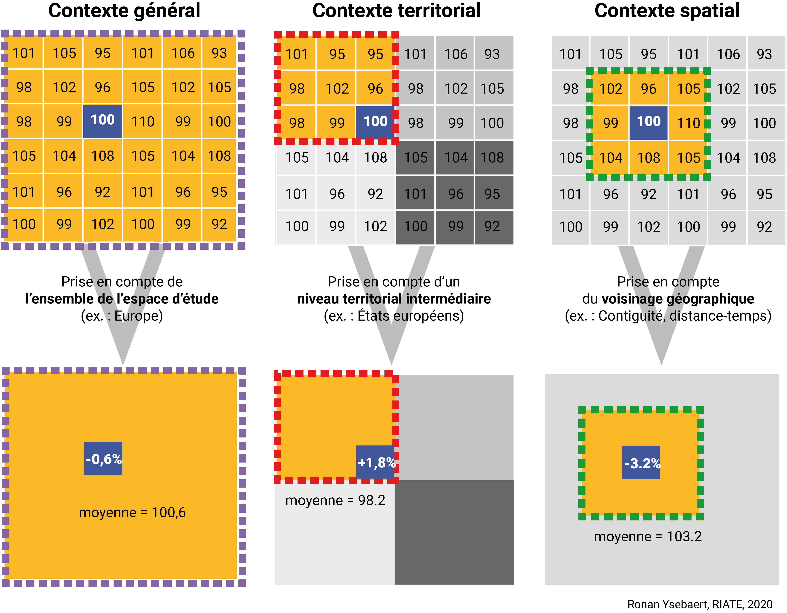
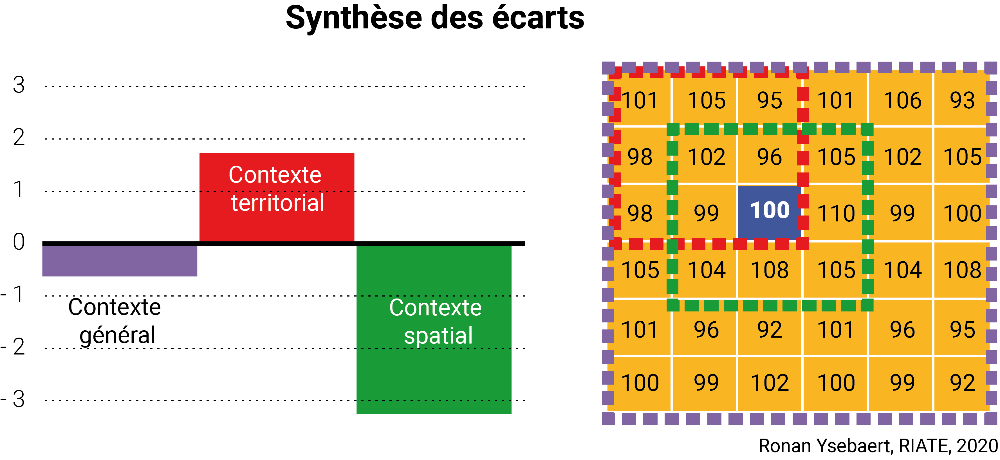

```{r setup, include=FALSE, eval = TRUE}
## Global options
knitr::opts_chunk$set(echo=TRUE,
        	            cache=FALSE,
                      prompt=FALSE,
                      comment=NA,
                      message=FALSE,
                      warning=FALSE,
                      class.source="bg-info",
                      class.output="bg-warning")


```


```{r packages_rmd, echo=FALSE, eval=TRUE, results=FALSE}
#  Packages nécessaires
my_packages <- c("MTA", "sf", "cartography", "readxl", "flextable", "ineq", 
                "spdep", "mapsf")

# Vérifier si ces packages sont installés
missing_packages <- my_packages[!(my_packages %in% installed.packages()[,"Package"])]

# Installation des packages manquants depuis le CRAN
if(length(missing_packages)) install.packages(missing_packages, 
                                              repos = "http://cran.us.r-project.org")

# Chargement des packages nécessaires
lapply(my_packages, library, character.only = TRUE)
invisible(lapply(my_packages, library,  character.only = TRUE))


```

```{r template_table, eval=TRUE, echo = FALSE}
# Modèle de mise en page des tableaux
ft <- function(x, id_num){ 
  x %>% flextable() %>% 
    colformat_double(j = id_num, digits = 1, big.mark = "") %>%
    theme_vanilla() %>%
    autofit() %>%
    fontsize(size = 9)
}  
```

<p style="background-color: #dcdcdc ; border-color:navajowhite3; padding: 1em; font-size:115% ; color: CCCCCC">
Cette fiche présente une **analyse territoriale multiscalaire** menée sur la **concentration de l'emploi** dans les communes de la **métropole du Grand Paris** (MGP)^[__Métropole__ : en France, un établissement de coopération intercommunale (EPCI) qui correspond à une des formes les plus intégrées d'intercommunalité. Elle concerne des territoires de plus de 400 000 habitants situés dans des aires urbaines de plus 650 000 habitants. Au 1er janvier 2019, la France compte 21 métropoles. Elles exercent de plein droit, en lieu et place de leurs communes membres, les compétences en matières d'aménagement de l'espace métropolitain ; de développement et d'aménagement économique, social et culturel ; de politique locale de l'habitat ; de protection et de mise en valeur de l'environnement et de politique du cadre de vie.]. Cette analyse reproductible utilise des données de l'INSEE librement accessibles et montre l'usage et l'intérêt des fonctions du package `MTA` (**Multiscalar Territorial Analysis**) pour révéler l'existence d'inégalités territoriales dans un contexte multiscalaire.</p>


<ul style="background-color: #dcdcdc ; border-color:navajowhite3; padding: 0.8em; font-size:115% ; color: CCCCCC">
**Prérequis** : connaissance en analyse de données et en représentations graphiques (plots, cartographie) avec R. 
</ul>


# Aux origines de MTA...

Le socle méthodologique sur lequel repose le package `MTA` (**Multiscalar Territorial Analysis**) a été conceptualisé dans le courant des années 2000 par le **groupe de recherche HyperCarte** [@grasland2005]. Bien qu'il ait été conçu dès le départ pour des applications sur des territoires ou des indicateurs quelconques, il s'est d'abord fait connaître à travers la production d'HyperAtlas, outil conçu pour analyser les inégalités régionales en Europe, dans le cadre du programme ESPON (*European Spatial Planning Observatory Network*)^[__ESPON__ : [programme européen de recherche appliquée](https://www.espon.eu/) qui vise à produire de la connaissance, des méthodes et des préconisations politiques sur les dynamiques territoriales européennes, principalement à l'échelle régionale.].


## HyperAtlas : un révélateur des contradictions de la  politique régionale européenne

L'objectif politique et empirique de la première application était de montrer que la définition des régions en retard de développement dépend du contexte d'observation et que celui-ci peut se définir d'au moins trois façons différentes. Si l'on prend par exemple le PIB par habitant en parité de pouvoir d'achat, et que l'on fixe un seuil de -25 % à la valeur de référence, trois listes différentes de régions en retard se révèlent : 

- *contexte européen* : régions ayant un PIB/hab. inférieur de 25 % à la moyenne de l'Union européenne  
- *contexte national* : régions ayant un PIB/hab. inférieur de 25 % à la moyenne de son pays d'appartenance  
- *contexte local* : régions ayant un PIB/hab. inférieur de 25 % à la moyenne des régions voisines

Une telle analyse était perturbante pour les décideurs politiques européens car elle mettait en évidence les contradictions qui pouvaient apparaître entre les politiques de solidarité menées à différentes échelles territoriales et spatiales [@grasland2004]. 

La contradiction la plus connue concernait l'emboîtement des échelles politiques territoriales [@davezies1997]. Paradoxalement, une même région pouvait être définie comme désavantagée au niveau européen (et percevoir à ce titre des aides) mais avantagée au niveau national (et obligée de ce fait à reverser des aides aux régions plus défavorisées de son propre pays).  

Une seconde contradiction concernait les effets d'accessibilité spatiale et le rôle des acteurs économiques dans un contexte d'ouverture des frontières et d'élargissement de l'UE de 15 à 25. L'indicateur de contexte local mettait en effet en valeur des régions plus riches que leurs voisines, alors même qu'elles étaient plus pauvres que la moyenne européenne ou la moyenne nationale. Elles constituaient donc des pics locaux de richesse. Inversement, des régions plus riches que la moyenne européenne ou nationale étaient plus pauvres que leurs voisines et constituaient des territoires localement désavantagés. Or, les économistes spatiaux étaient déjà en plein débat sur les effets de ces avantages comparatifs locaux. Pour les partisans du *spillover effect*^[__Spillover effect__ : en économie les effets de spillover (ou débordement) sont des événements qui se produisent dans un contexte donné à cause d'autre chose survenant dans un contexte apparemment sans rapport.], les pôles de richesse diffuseraient la prospérité vers les régions voisines, tandis que pour les partisans du *backwash effect*^[__Backwash effect__ : concept issu du champ de l'économétrie spatiale qui stipule que la croissance économique offre des avantages et des coûts dans la région où elle se produit. Cela a un impact positif sur les territoires voisins si les emplois, la population et la richesse se répandent dans ces communautés. Au contraire, les effets sont néfastes sur les localités voisines si la croissance dans la région centrale attire les populations et les activités des régions périphériques. L'effet backwash se produit si les effets négatifs dominent et que l'activité économique dans les régions périphériques diminue.], ce serait plutôt le contraire [@oecd2001; @camagni2009].

L'intérêt de combiner les trois types d'inégalités a conduit le programme ESPON à financer le développement  de l'application **HyperAtlas** [@martin2004; @thomas2008; @lerubrus2011], qui permet de mener une analyse territoriale multiscalaire dans un environnement logiciel dédié.

Cet outil ([ESPON 2020](https://www.espon.eu/HyperAtlas-3.0){target="_blank"}) a bénéficié d'une importante reconnaissance autour de 2010, et plusieurs versions ont été implémentées dans divers projets européens, notamment pour permettre l'analyse des disparités régionales sur des indicateurs socio-économiques à l'échelle de l'Union européenne [@espon2004; @ep2007]. Cet outil ([ESPON 2020](https://www.espon.eu/HyperAtlas-3.0){target="_blank"}), a aussi suscité l'intérêt de l'Éducation nationale, notamment pour proposer aux élèves de 1re un cadre méthodologique adapté pour [*enseigner les disparités socio-spatiales au sein de l'UE*](https://www.ac-paris.fr/portail/jcms/p1_986484/enseigner-les-disparites-socio-spatiales-au-sein-de-l-ue-avec-hyperatlas-1ere){target="_blank"}. 

[Cette présentation](https://riate.cnrs.fr/wp-content/uploads/2015/04/20150402_HyperAtlas.pdf){target="_blank"} réalisée en avril 2015 lors d'un atelier organisé au Commissariat général à l'égalité des territoires (CGET, désormais ANCT) synthétise l'histoire et le fonctionnement de cet outil. 


## HyperCarte : un projet de recherche interdisciplinaire

Le groupe de recherche HyperCarte, actif entre 1996 et 2015, reposait sur quatre équipes de recherche en géographie ([RIATE](https://riate.cnrs.fr/){target="_blank"} et [Géographie-cités](https://www.parisgeo.cnrs.fr/){target="_blank"}) et en informatique ([LIG-STEAMER](http://steamer.imag.fr/){target="_blank"} et [LIG-MESCAL](http://mescal.imag.fr/){target="_blank"}). 

Si le développement d'applications pour l'Union européenne a constitué une activité privilégiée, il a toujours été clair que le projet avait une portée plus générale et pouvait s'appliquer à d'autres échelles. Plusieurs instances ont ainsi été proposées afin d'étudier les inégalités territoriales dans différents contextes spatiaux (Monde, Europe, territoires locaux). Pour en savoir plus, se reporter à la [page Web du projet HyperCarte](http://hypercarte.imag.fr/){target="_blank"} qui restitue l'historique du projet, les concepts mobilisés et les publications associées.  

Ces applications ont permis de monter en généralité et de proposer une vision plus globale des concepts mis en oeuvre dans HyperAtlas en redéfinissant les trois contextes d'un point de vue plus théorique :

- Le **contexte global** analyse la position d'un lieu par rapport à l'ensemble des lieux étudiés qui forment l'espace de référence.
- Le **contexte territorial** analyse la position d'un lieu par rapport à une partition de l'espace de référence en mailles territoriales. Chaque lieu appartient à une maille et une seule qui définit son contexte territorial.
- Le **contexte spatial** analyse la position d'un lieu par rapport à un ensemble de lieux voisins. Ce voisinage peut aussi bien être basé sur la contiguïté (frontière commune) que sur une accessibilité mesurée en temps, coût ou kilomètre. Comme dans les modèles d'autocorrélation spatiale^[__Indices d'autocorrélation spatiale__ : ont été développés à partir des années 1950 afin de mettre en évidence une relation entre voisins qui serait plus marquée que la relation avec le reste du groupe.], on introduit une fonction de pondération pour que la somme des voisinages de chaque lieu soit égale à 1 [@anselin1995].

Il est important de préciser que, dans ce cadre théorique, la variable $Z = \frac{V}{P}$ utilisée pour analyser les inégalités entre les lieux  doit obligatoirement correspondre à un **modèle d'allocation d'une ressource par rapport à une population de référence**.  La référence implicite de l'analyse des inégalités est en effet l'**équirépartition** des ressources par rapport à la population, quelle que soit l'échelle considérée. 

On peut donc utiliser les procédures mise au point dans HyperAtlas pour étudier la richesse (*V*) par habitant (*P*) ou le nombre d'automobile (*V*) par ménage (*P*). Mais il ne serait pas logique  d'appliquer la méthode à la densité de population, sauf si l'on inverse le rapport et considère la quantité d'espace (*V*) par habitant (*P*). 


## Le package `MTA`

Aujourd'hui, HyperCarte n'est plus actif et HyperAtlas plus maintenu. **L'objectif du package** `MTA` **consiste à mettre à disposition les connaissances, les méthodes et les solutions de visualisation développées durant des années de recherche par le biais de fonctions R**. L'adaptation en langage R permet de s'affranchir des limites liées à l'usage d'une application clic-bouton, où l'import des données s'avérerait relativement complexe et la modularité des analyses peu flexible pour pousser l'aspect d'exploration des données.   

D'un point de vue conceptuel, HyperAtlas et `MTA` reposent sur l'hypothèse que la signification d'un indicateur dépend du contexte territorial de référence dans lequel il s'inscrit. 

<center>
{width=90%}
</center>
<br>

Confronter ces contextes d'analyse en utilisant des représentations synoptiques permet de synthétiser les inégalités mesurées et de mettre en évidence des situations de domination, de soumission ou de contradiction [@ysebaert2011]. La mise à disposition de ces trois mesures d'écarts - associées à des représentations graphiques et cartographiques adaptées - sont au coeur d'HyperAtlas et des fonctions d'analyse proposées par `MTA`. 

<center>
{width=70%}
</center>

<br>

Un préalable essentiel à l'analyse multiscalaire consiste à identifier :    

- un indicateur ($Z = \frac{V}{P}$)     
- des contextes qui font sens d'un point de vue thématique ou politique     

Nous proposons ci-dessous une analyse multiscalaire du rapport entre l'emploi au lieu de travail et les actifs occupés au lieu de résidence dans les communes de la métropole du Grand Paris en 2016. Dans la logique d'équirépartition expliquée précédemment, les emplois constituent donc une ressource (*V*) et les actifs occupés  la population de référence (*P*). Le rapport $Z = \frac{V}{P}$ permet donc de mesurer dans quelle mesure le nombre d'emplois disponibles en un lieu est en adéquation avec la population active présente. 

Les contextes de déviation utilisés seront la métropole du Grand Paris (déviation générale), l'EPCI^[__EPCI__ : établissement de coopération intercommunale. Il s'agit d'une structure administrative regroupant plusieurs communes afin d'exercer certaines compétences en commun. Aujourd'hui, en principe, chaque commune doit appartenir à un EPCI à fiscalité propre, en vertu de la loi NOTRe de 2015.] d'appartenance (déviation territoriale) et les unités territoriales qui partagent une limite communale (déviation spatiale).

<br>

# Objectifs et données mobilisées

## Objectifs

Les emplois sont-ils situés à proximité du domicile des employés ? Trouve-t-on dans chaque commune autant d'emplois qu'il y a d'actifs ? C'est l'approche que nous proposons d'explorer dans les différents contextes territoriaux de la métropole du Grand Paris.

Nul besoin d'être expert en géographie de l'emploi pour percevoir son inégale répartition sur ce territoire : certaines municipalités concentrent les emplois (La Défense, Paris), quand d'autres ont une vocation quasi-exclusivement résidentielle (banlieues pavillonnaires, cités-dortoirs).

Raisonner sur l'asymétrie qui existe entre offre d'emploi et lieu de résidence des actifs ne constitue pas une nouveauté. Comme l'a montré Kain avec le concept du *spatial mismatch*^[__Spatial mismatch__ : exprime l'inadéquation entre le lieu de résidence des ménages à faible revenu et les opportunités convenables d'emploi. Ce concept a été initialement utilisé aux Etats-Unis pour des études portant sur la population afro-américaine, en raison de la ségrégation résidentielle, de la restructuration économique et de la suburbanisation de l'emploi.] appliqué à l'inégale répartition de l'emploi pour certaines catégories de population (les Afro-Américains) [@kain1968; @kain1992]. Dans la région parisienne, les travaux récents de l'UMR Géographie-cités autour du [Mobiliscope](https://mobiliscope.parisgeo.cnrs.fr/fr){target="_blank"} ont mis en évidence les inégalités d'accès à l'emploi en fonction des lieux de résidence des actifs et leurs spécificités (catégories socio-professionnelles, etc.) et les coûts de transport induis [@leroux2017].

Cette analyse ne vise bien entendu pas à révolutionner ce champ de recherche déjà fécond, mais plutôt à apporter des compléments méthodologiques pour explorer ce type de données, car les ordres de grandeur qui structurent ces inégalités sont plus méconnus, que ce soit en termes de masse d'emplois ou de configurations territoriales plus spécifiques (métropole du Grand Paris, EPCI ou voisinage géographique proche). Ces contextes territoriaux sont par ailleurs, au niveau local, des échelons essentiels pour la prise de décision politique (aménagement et organisation sociale) et pour l'emploi :

- La **métropole du Grand Paris** (composée de 12 EPCI : 11 communautés d'agglomération et Paris) a notamment pour compétence l'aménagement économique, social et culturel, et la politique du cadre de vie. 
- La **communauté d'agglomération** a pour compétence obligatoire l'aménagement de l'espace, le développement économique, l'équilibre social de l'habitat et la politique de l'habitat. 
- Le niveau administratif de base en France, la **commune**, est la collectivité territoriale de proximité. Malgré la réduction de ses compétences en matière d'aménagement avec la loi NOTRe d'août 2015, elle conserve des compétences marquées en matière d'urbanisme, d'aide sociale ou de logement. C'est aussi bien souvent le niveau administratif auquel se rattachent naturellement les résidents. 

D'un point de vue purement méthodologique, le fait d'utiliser des jeux de données non modifiés issus de fournisseurs institutionnels de référence (INSEE pour les données, IGN pour les géométries), associés à une approche reproductible, permet de mettre à jour l'analyse ou de la transposer à d'autres espaces d'études. Ainsi, moyennant une interprétation adaptée des sorties statistiques, graphiques et cartographiques proposées, cette analyse peut utilement compléter les diagnostics territoriaux menés par de nombreuses institutions comme l'[Apur](https://www.apur.org/fr/nos-travaux/data-portraits-communes-territoires-metropole-grand-paris){target="_blank"}, ou la Direction régionale et interdépartementale de l'Équipement et de l'Aménagement (DRIEA), qui s'intéresse dès la page 14 de [son rapport de 2015](http://www.driea.ile-de-france.developpement-durable.gouv.fr/IMG/pdf/Contribution_au_diagnostic_de_la_MGP-nov-2015-WEB.pdf){target="_blank"} au même indicateur que dans cette analyse. 


## Sources mobilisées

Cinq sources de données sont mobilisées dans cette analyse :

**1)** [**CONTOURS...IRIS®**](https://geoservices.ign.fr/contoursiris){target="_blank"} : les géométries des IRIS^[__IRIS__ : signifie « îlots regroupés pour l'information statistique ». Il s'agit d'un découpage territorial en mailles de taille homogène (environ de 2 000 habitants) proposé par l'INSEE. Ce découpage constitue la brique de base en matière de diffusion de données infra-communales.] de France métropolitaine et leur commune d'appartenance, au découpage du 1er janvier 2019, fournies par l'IGN.

**2)** [**Table d'appartenance géographique**](https://www.insee.fr/fr/information/2028028){target="_blank"} : l'appartenance des communes (version 2019) à leur EPCI de rattachement et le type de coopération (communautés de communes, communautés d'agglomération, communautés urbaines, métropoles) au 1er janvier 2019. Ce fichier est distribué par l'INSEE. 

**3)** [**Emploi-activité en 2016**](https://www.insee.fr/fr/statistiques/4171446?sommaire=4171473){target="_blank"} : des indicateurs sur l'emploi au lieu de travail et la population active occupée en 2016, mis à disposition par l'INSEE à l'échelon communal. 

 **4)** [**Logement en 2016**](https://www.insee.fr/fr/statistiques/4228432){target="_blank"} : des indicateurs décrivant le niveau de motorisation des ménages à l'échelle des IRIS et mis à disposition par l'INSEE. 

Un cinquième fichier, [**metropole.xls **](https://rzine.fr/docs/20211101_ysebaert_grasland_MTA/data/metropoles.xlsx), construit par nos soins à partir des sites Web de référence des métropoles, vise à identifier des sous-ensembles territoriaux cohérents à l'intérieur de ces métropoles. Dans le cadre de la métropole du Grand Paris, il s'agit des 11 communautés d'agglomération (+ Paris). Pour les autres métropoles, l'importance des EPCI intermédiaires est moins prépondérante, puisque les métropoles ont vocation à remplacer les anciens EPCI. Nous avons néanmoins restitué quand c'était possible la géographie de ces anciennes mailles de décision afin de disposer d'un découpage territorial intermédiaire entre les communes et les métropoles. Quand ce maillage intermédiaire était inexistant (transformation de communautés urbaines en métropole sans inclusion de nouvelles communes au périmètre de coopération), nous avons uniquement fait la distinction entre la ville centre (LIB_EPCI = C) et sa périphérie (LIB_EPCI = P). 

Hormis ce dernier fichier, il s'agit donc de sources de données officielles, mises à jour annuellement, qui sont associées à un découpage géographique libre de droit et dd'utilisation, ce qui facilite la mise à jour et la transposition des analyses. 

Pour rejouer la préparation des données - jointures attributaires, sélection des métropoles, agrégation par clé d'appartenance territoriale - se reporter à ce [script R](https://rzine.fr/docs/20211101_ysebaert_grasland_MTA/prepa.R).


## Données consolidées

Le script de préparation des données aboutit à la création d'un geopackage constitué de quatre couches géographiques qui seront utilisées dans l'analyse : 

- `iris` : la couche géographique des IRIS, qui contient des données relatives à la motorisation des ménages.
- `com` : celle des communes, qui contient des données relatives à l'emploi au lieu de travail. **C'est le principal jeu de données utilisé dans cette fiche**.
- `epci` : la couche géographique des communautés d'agglomération (EPCI) contenues dans les métropoles, qui sera utilisé pour l'habillage des cartes.  
- `metropole` : celle des métropoles, que l'on pourrait éventuellement utiliser à des fins d'habillage. 

Voici le détail des indicateurs inclus dans les couches géographiques des communes et des IRIS. 


### Communes

C'est la couche principale qui sera utilisée dans cette fiche. 

```{r meta_com, echo = FALSE, eval = TRUE, message=FALSE, warning=FALSE}
## Synthèse (table)
tmp <- read.csv("data/com_meta.csv", sep = ",",  fileEncoding="UTF-8")
ft(tmp, id_num = NULL)


```

### IRIS

C'est la couche qui sera utilisée en fin de document pour discuter de la transposition de l'analyse à un autre espace d'étude. 

```{r meta_iris, echo = FALSE, eval = TRUE, message=FALSE, warning=FALSE}
## Synthèse (table)
tmp <- read.csv("data/iris_meta.csv", sep = ",",  fileEncoding="UTF-8")
ft(tmp, id_num = NULL)
```


### Emprise géographique

Ces données sont disponibles pour les [22 métropoles françaises](https://www.insee.fr/fr/statistiques/3694585).

```{r geographical_objects, echo = FALSE, eval = TRUE, message=FALSE, warning=FALSE}
## Synthèse (table)
iris <- st_read("data/data.gpkg", layer = "iris", quiet=TRUE)
tmp <- st_set_geometry(iris, NULL)

tmp <- aggregate(x = tmp[,c("CODE_IRIS", "INSEE_COM", "LIB_EPCI_SUB")], 
                 by = list(LIB_EPCI = tmp$LIB_EPCI),
                 function(x) length(unique(x)))

colnames(tmp) <- c("Métropole", "Nb IRIS", "Nb Communes", "Nb EPCI intermédiaires")

ft(tmp, id_num = NULL)
```


<br>

# Initialisation de l'analyse

## Packages nécessaires

Cinq packages R sont requis pour reproduire les analyses présentées dans cette fiche : 

- `MTA` pour la mesure des écarts multiscalaires  
- `sf` pour la manipulation et le traitement de données géographiques
- `mapsf` pour les représentations cartographiques
- `ineq` pour le calcul d'indices économétriques de concentration
- `spdep` pour le calcul des indices d'autocorrélation spatiale 

Le code ci-dessous vérifie que toutes les librairies requises sont bien installées. Dans le cas contraire, elles sont installées puis chargées dans la session de travail. 

```{r packages_viz, echo=TRUE, eval=FALSE, results=FALSE}
# Noms de packages nécessaires
my_packages <- c("MTA", "sf", "ineq", "spdep", "mapsf")

# Vérifier si ces packages sont installés
missing_packages <- my_packages[!(my_packages %in% installed.packages()[,"Package"])]

# Installation des packages manquants depuis le CRAN
if(length(missing_packages)) install.packages(missing_packages, 
                                              repos = "http://cran.us.r-project.org")

# Chargement des packages nécessaires
lapply(my_packages, library, character.only = TRUE)
invisible(lapply(my_packages, library,  character.only = TRUE))
```


## Import des données

<br/>

<p class="center">[<span style="font-size: 230%;" class="glyphicon glyphicon-download-alt"></span> <br/> Télécharger les données](https://rzine.fr/docs/20211101_ysebaert_grasland_MTA/data.zip)</p>

<br/>

Pour rejouer l'analyse, décompressez les données contenues dans l'archive [data.zip](https://rzine.fr/docs/20211101_ysebaert_grasland_MTA/data.zip) puis ouvrez les couches ***com*** et ***epci*** contenues dans le geopackage ***data.gpkg***.   


```{r import_data_consolidated}
# Import des données (après les avoir téléchargées et décompressées)
com <- st_read("data/data.gpkg", layer = "com", quiet = TRUE) 
epci <- st_read("data/data.gpkg", layer = "epci", quiet = TRUE) 
```

Nous filtrons ce jeu de données (22 métropoles) pour ne considérer que les unités territoriales qui appartiennent à la métropole du Grand Paris. 

```{r import_data_consolidated2}
# Filtrer sur Paris
com <- com[com$LIB_EPCI == "Métropole du Grand Paris",]
epci <- epci[epci$LIB_EPCI == "Métropole du Grand Paris",]
```

L'objet ***com*** contient toutes les informations nécessaires à la réalisation de l'analyse : des identifiants géographiques (code communal et nom de la commune), la métropole d'appartenance de la commune (*METRO*), l'identifiant et le nom de l'EPCI d'appartenance (*LIB_EPCI_SUB* et *POS*), des données socio-économiques (*P16_EMPLT* et *C16_ACTOCC15654*) et les géométries communales. 

```{r meta1}
head(com)
```


## Numérateur - dénominateur

`MTA` requiert un **ratio défini par un numérateur et un dénominateur** pour calculer les déviations et redistributions. Nous allons ici mettre en relation l'emploi localisé au lieu de travail (*P16_EMPLT*) et le lieu de résidence des actifs occupés, âgés de 15 à 64 ans (*C16_ACTOCC1564*). 

Pour faciliter la réutilisation / mise à jour du code, le numérateur est renommé *num* et le dénominateur *denom*. Le ratio ciblé est aussi calculé. Ainsi, un indice supérieur à 1 signifie que la commune dispose de plus d'emplois que d'actifs occupés résidents, et inversement. 

```{r select_indicators, eval=TRUE, results="hide", message=FALSE, warning=FALSE}
# Initialisation de l'analyse
num <- which(colnames(com) == "P16_EMPLT")
denom <- which(colnames(com) == "C16_ACTOCC1564")
colnames(com)[c(num,denom)] <- c("num", "denom") 

# Retirer les valeurs égales à 0
com <- com[com$num != 0 & com$denom != 0,]

# Calculer le ratio de référence
com$ratio <- com$num / com$denom  
```


## Présentation de l'espace d'étude

Notre espace d'étude, la métropole du Grand Paris, est composé de 150 communes, assemblées en 12 regroupements de communes (11 communautés d'agglomération + Paris). La palette de couleurs utilisée restitue les départements d'appartenance de ces territoires, nous la réutiliserons par la suite sur certaines représentations graphiques. 

Les représentations cartographiques sont réalisées avec le [package `mapsf`](https://riatelab.github.io/mapsf/) (consulter la [documentation](](https://riatelab.github.io/mapsf/)) pour davantage d'information). L'utilisation de ce package n'est pas détaillée dans cette fiche, nous précisons cependant que la mise en page des cartes repose sur un thème défini dans le code ci-dessous (`mta_theme()`). Chaque carte obéit à la même logique :

- initialisation de la carte et du thème avec `mf_init()`
- représentation cartographique avec `mf_map()`
- représentation des contours d'EPCI pour l'habillage cartographique avec`mf_map()`
- ajout des éléments d'habillage de la carte : `mf_title()`, `mf_credits()`et `mf_scale()`

```{r cas_etude_prez, eval=TRUE, results="hide", message=FALSE, warning=FALSE}
# Ordre des labels et couleurs pour les EPCI
epts <- c("Paris", "Est Ensemble", "Grand Paris Grand Est", "Paris Terres d'Envol",   
          "Plaine Commune", "Boucle Nord de Seine", "Paris Ouest - La Défense", 
          "Grand Paris Seine Ouest",  "Vallée Sud Grand Paris",  
          "Grand-Orly Seine Bièvre", "Grand Paris Sud Est Avenir",
          "Paris Est Marne et Bois")

# Couleurs
cols <- c("#cfcfcf", # Gris (Paris)
          "#92C8E0", "#7BB6D3", "#64A4C5", "#458DB3", # Bleus (Seine-Saint-Denis)
          "#A6CC99", "#8CBB80", "#71A966", "#4E9345", # Verts (Hauts-de-Seine)
          "#F38F84",  "#EF6860",  "#EA3531") # Rouges (Val-de-Marne)

colEpt <- data.frame(epts, cols)

# Un thème cartographique pour l'ensemble des cartes produites
mta_theme <- list(bg = NA, fg = NA, mar = c(0, 0, 0, 0), tab = TRUE, pos = "left", 
                  inner = TRUE, line = 1.3, cex = 1, font = 2)


# Cartographie
# Appeler le thème
mf_init(epci, expandBB = c(0,0.2,0,0), theme = mta_theme)

# Carte de typologie
mf_map(x = com, type = "typo", var = "LIB_EPCI_SUB", val_order = epts,
       pal = cols, border = "white", lwd = 0.2, leg_val_cex = 0.7,
       leg_title = NA, leg_pos = "bottomleft", add = TRUE)

# Contour des EPCI
mf_map(x = epci, col = NA, border = "black", lwd = 1, add = TRUE)

# Titre
mf_title("Les territoires d'appartenance des 150 communes de la MGP")

# Echelle
mf_scale(size = 5, col = "black", pos = c(666000, 6839000)) 

# Sources
credits <- "Sources : INSEE, IGN, 2021 / Réalisation : Ronan Ysebaert, RIATE, 2021"
mf_credits(txt = credits, pos = "rightbottom", cex = 0.5)
```


## Résumé statistique

L'analyse des ordres de grandeur des numérateurs, dénominateurs et ratios souligne la grande hétérogénéité des situations au sein de la MGP. Certaines communes n'hébergent que quelques centaines d'emplois ou d'actifs, tandis que d'autres plusieurs dizaines de milliers. 

Dans son ensemble, la MGP cumule 3,9 millions d'emplois, pour 3,1 millions d'actifs occupés au lieu de résidence. Le rapport emploi localisé / actifs occupés est donc excédentaire (1,26 emplois par actif occupé résidant dans la MGP). Cela s'explique naturellement par le fait que les emplois localisés au sein de la MGP sont occupés par des actifs résidant en dehors de la métropole, notamment dans le reste de l'Île-de-France. L'INSEE rappelle à ce titre qu'en "2015, plus d'un million d'actifs occupés ne résidant pas dans la métropole du Grand Paris s'y rendent quotidiennement pour travailler. Ils occupent 26 % des emplois parisiens" [@insee2019]. Les flux en sens inverse sont bien moindre, même si une partie des habitants de la MGP travaillent en dehors, en Grande Couronne ou hors Île-de-France.

```{r summary_stat, eval=TRUE, message=FALSE, warning=FALSE}
stat <- st_set_geometry(com, NULL)

# Résumé statistique
summary(stat[c("num", "denom", "ratio")])

# Somme des emplois au lieu de travail (milliers)
round(sum(stat$num)/1000, 0)

# Somme des actifs occupés au lieu de résidence (milliers)
round(sum(stat$denom)/1000, 0)      
      
# Moyenne pondérée
moy <- round(sum(stat$num) / sum(stat$denom), 2)
moy
```

Une simple représentation du nombre d'emplois et d'actifs occupés permet de juger de l'inégale répartition géographique de ces masses. Bien évidemment structurées selon un modèle centre-périphérie autour de Paris, ces représentations laissent néanmoins percevoir des distinctions entre emplois et actifs. 

```{r num_denom, eval=TRUE, results="hide", message=FALSE, warning=FALSE}
# Découpage de la fenêtre graphique en 1 ligne / 2 colonnes
# Ce qui permet de mettre deux cartes en vis-à-vis
par(mfrow = c(1,2))

# Carte du numérateur
mf_init(epci, expandBB = c(0.02, 0.02, 0.02, 0.02), theme = mta_theme)
mf_map(epci, col = "peachpuff", border = "black", lwd = 1, add = TRUE)
mf_map(type = "prop", x = com, var = "num", col = "#F6533A", border = "white",
       leg_pos = "bottomleft", leg_val_rnd = -2, inches = 0.15,
       leg_title = "Nombre d'emplois\nau lieu de travail, 2016", add = TRUE)
mf_title("Numérateur - Emploi au lieu de travail")
mf_scale(size = 5, col = "black", pos = c(666000, 6839000)) 

# Carte du dénominateur
mf_init(epci, expandBB = c(0.02, 0.02, 0.02, 0.02), theme = mta_theme)
mf_map(epci, col = "peachpuff", border = "black", lwd = 1, add = TRUE)
mf_map(type = "prop", x = com, var = "denom", col = "#515FAA", border = "white",
       leg_pos = "bottomleft", leg_val_rnd = -2, inches = 0.15,
       leg_title = "Nombre d'actifs\nau lieu de résidence", add = TRUE)
mf_title("Dénominateur - Actifs au lieu de résidence, 2016")
mf_credits(txt = credits, pos = "rightbottom", cex = 0.5)
```

La carte choroplèthe qui en découle représente le ratio emploi au lieu de travail / actifs occupés au lieu de résidence. Elle met en évidence les principales configurations spatiales qui structurent la MGP. La métropole est caractérisée par d'important différentiels puisqu'un rapport de 39 existe entre la valeur maximale (8e arrondissement de Paris : `r round(max(com$ratio),2)`) et la valeur minimale (Ablon-sur-Seine : `r round(min(com$ratio),2)`).

```{r ratio_choro, eval=TRUE, results="hide", message=FALSE, warning=FALSE}
# Paramètrage de la fenêtre graphique
par(mfrow = c(1,1))

# Palette (Color Brewer)
cols <- c("#FCFBFD", "#EFEDF5", "#DADAEB", "#BCBDDC", "#9E9AC8", "#807DBA", "#6A51A3",
         "#4A1486")

# Carte de concentration de l'emploi au regard des actifs
mf_init(epci, expandBB = c(0,0.2,0,0), theme = mta_theme)
mf_map(x = com, var = "ratio", type = "choro", 
       breaks = c(min(com$ratio), 0.5, 0.75, 1, 1.25, 1.50, 1.75, 2, max(com$ratio)),
       pal = cols, border = "white", lwd = 0.2, leg_pos = "bottomleft", leg_val_rnd = 2, 
       leg_title = "Emploi au lieu de travail /\nactifs occupés au lieu de résidence, 2016",
       add = TRUE)
mf_map(x = epci, col = NA, border = "black", lwd = 1, add = TRUE)
mf_title("Ratio d'intérêt : concentration d'emploi au lieu de travail dans la MGP")
mf_scale(size = 5, col = "black", pos = c(666000, 6839000)) 
mf_credits(txt = credits, pos = "rightbottom", cex = 0.5)

# Labels 
mf_label(x = com[which.min(com$ratio),], var = "NOM_COM", halo = TRUE, cex = 0.6, 
         bg = "white")
mf_label(x = com[which.max(com$ratio),], var = "NOM_COM", halo = TRUE, cex = 0.6,
         bg = "white")
```

<br>

# Analyses multiscalaires

## Eléments de méthode

### Contextes général, territorial et spatial

`MTA` propose trois fonctions pour mener une exploration multiscalaire et donner à voir autrement les inégalités qui structurent cet espace d'étude : 

- `gdev` : le **contexte général** évalue la situation de chaque unité territoriale au regard d'un ensemble (ou d'une valeur) de référence. Dans notre cas, il s'agit de la **moyenne de la métropole du Grand Paris**. 

- `tdev` : le **contexte territorial** calcule l'écart des unités territoriales au regard d'un niveau territorial de référence intermédiaire englobant, défini par une table d'appartenance. Dans ce cas, il s'agira d'évaluer le positionnement des communes par rapport à la moyenne de leur **EPCI d'appartenance**. 

- `sdev` : le **contexte spatial** présente cet écart au regard d'un voisinage géographique. Dans `MTA`, le critère de voisinage peut être défini de trois façons : selon le critère de contiguïté (d'ordre 1, 2 ou *n*), selon un critère de distance (centroïdes des unités territoriales localisées à moins de *X* mètres à vol d'oiseau) ou selon des valeurs incluses dans une matrice de distance, définies par l'utilisateur (temps de transport routier, par exemple). Dans `MTA`, les déviations selon les critères de contiguïté ou de distance sont calculées directement par la fonction `sdev`. Si l'utilisateur souhaite importer sa propre matrice de distance, celle-ci doit être contenue dans un *dataframe* avec les champs suivants : *id1*, *id2*, mesure de distance. Dans le cas présent et compte tenu de la relative homogénéité de surface des unités territoriales, nous retiendrons le **critère de contiguïté d'ordre 1**, c'est-à-dire le fait que deux communes soient voisines, pour évaluer la déviation spatiale. 

### Méthodes absolue et relative

Dans `MTA`, deux méthodes sont proposées pour quantifier ces déviations : 

- La **méthode relative** exprime la position de chaque unité territoriale au regard de la moyenne du contexte de référence, exprimé en indice 100. Cette déviation est calculée de la façon suivante : 
$$
Déviation~Relative~(région~i) = \frac{\frac{Numérateur(région~i)}{Dénominateur(région~i)}}{\bar{x}(contexte~de~ référence)} \times 100
$$
Ainsi, les unités territoriales caractérisées par un indice inférieur à 100 sont situées sous la moyenne du contexte de référence, et inversement. La méthode relative est donc un **outil de diagnostic** qui permet de mesurer l'intensité des inégalités par rapport à un modèle hypothétique d'équirépartition^[__Equirépartition__ : pour cette analyse, elle implique des valeurs de ratio identique (numérateur / dénominateur) pour l'ensemble des unités territoriales du contexte d'analyse.].    
<br/>

- La **méthode absolue** mesure la redistribution de numérateur nécessaire pour aboutir à une parfaite équirépartition entre les unités territoriales (même ratio pour toutes les unités territoriales du contexte d'analyse). La redistribution peut être positive (une unité territoriale doit redistribuer aux autres) ou négative (une unité territoriale doit recevoir des autres). Cette déviation est calculée de la façon suivante : 
$$
Déviation~Absolue~(région~i) = Numérateur(région~i) - \bar{x}(espace~d'étude) \times Dénominateur(région~i)
$$
La méthode absolue est plutôt **un outil de prospective** puisqu'elle permet de mesurer la quantité de ressource qu'il faudrait théoriquement déplacer des zones favorisées vers les zones défavorisées pour aboutir à l'équirépartition. Si la ressource n'est pas mobile, elle permet symétriquement de mesurer la quantité de population qui devrait se déplacer des zones défavorisées vers les zones favorisées pour aboutir à l'équirépartition. 

Il convient d'insister une fois encore sur l'importance du choix du critère d'inégalité $Z = \frac{V}{P}$ qui est introduit dans le modèle `MTA` et sur la signification politique du critère d'équirépartition. Dans l'exemple étudié ici, ce qui est en jeu n'est rien moins que la politique de régulation des constructions de logement et de création d'emplois dans une région marquée de longue date par des déséquilibres persistants.


### Cartographie des résultats

Dans notre cas, la palette de couleurs proposée pour représenter les valeurs des déviations est celle suggérée dans HyperAtlas (bleu = inférieur à la moyenne, rouge = supérieur à la moyenne). 

Les valeurs des déviations absolues sont représentées par des figurés proportionnels. S'ils sont représentés en rouge, cela signifie que les communes bénéficient d'un excédent de ressource ; inversement les figurés représentés en bleu présentent les communes qui souffrent d'un déficit de ressource. 


### Représentations graphiques associées 

Des indicateurs statistiques et des représentation graphiques sont généralement associés à la cartographie des résultats. Ils s'inspirent en grande partie des fonctionnalités du logiciel HyperAtlas (courbes de Lorenz, boîtes à moustache) et permettent d'approfondir l'interprétation des résultats. 


## Déviation générale

### Calcul des déviations et cartographie

La **déviation générale** (déviation à la moyenne de l'ensemble de la MGP) se calcule avec la fonction `gdev`. Elle prend en entrée le numérateur (*num*) et le dénominateur (*denom*). La déviation relative est calculée avec l'argument `type = rel`.

```{r gdevrel, eval=TRUE, message=FALSE, warning=FALSE}
# Déviation générale
com$gdevrel <- gdev(x = com,  var1 = "num", var2 = "denom",  type = "rel")

# Palette de couleurs (déviation, 6 classes, origine Color Brewer)
devpal <-  c("#4575B4", "#91BFDB", "#E0F3F8", "#FEE090", "#FC8D59", "#D73027")

# Cartographie
mf_init(epci, expandBB = c(0,0.2,0,0), theme = mta_theme)
mf_map(x = com, var = "gdevrel", type = "choro", pal = devpal, 
       breaks = c(min(com$gdevrel), 75, 90, 100, 111, 133, max(com$gdevrel)),
       border = "white", lwd = 0.2, leg_pos = "left",  leg_val_rnd = 0, 
       leg_title = "Déviation au contexte général\n(100 = moyenne de la MGP)",
       add = TRUE)
mf_map(x = epci, col = NA, border = "black", lwd = 1, add = TRUE)
mf_title(paste0("Déviation générale"))
mf_scale(size = 5, col = "black", pos = c(666000, 6839000)) 
mf_credits(txt = credits, pos = "rightbottom", cex = 0.5)
```

Cette carte met en évidence les inégalités de concentration d'emplois dans le contexte de la MGP. Les communes au-dessus de la moyenne (100 = 1,26 emplois/actifs occupés) sont quasi exclusivement toutes situées dans la partie ouest de l'espace d'étude, à Paris ou dans les Hauts-de-Seine. Les arrondissements du nord-est parisien ont un ratio inférieur à la moyenne. Par ailleurs, on peut noter que la totalité des communes affiche un ratio inférieur à la moyenne dans 3 EPCI (Grand Paris Grand Est, Vallée Sud Grand Paris et Grand Paris Sud Est Avenir).

Les deux tableaux ci-dessous présentent les extrêmes (min et max) pour cette déviation.

```{r sort_gdevrel_high_show, eval=FALSE, message=FALSE, warning=FALSE, echo = TRUE}
# Déviation générale - déviations les plus élevées
df <- st_set_geometry(com, NULL)
df <- df[order(df$gdevrel, decreasing = TRUE), ]

df[1:10,c("INSEE_COM", "NOM_COM", "LIB_EPCI_SUB", "gdevrel" ,"num" ,"denom" ,"ratio")]
```

```{r sort_gdevrel_high_hide, eval=TRUE, message=FALSE, warning=FALSE, echo = FALSE}
# Déviation générale - déviations les moins élevées
df <- st_set_geometry(com, NULL)
df <- df[order(df$gdevrel, decreasing = TRUE), ]

ft(x = df[1:10,c("INSEE_COM", "NOM_COM", "LIB_EPCI_SUB", "gdevrel", "num", "denom", "ratio")],
   id_num = c("gdevrel", "num", "denom", "ratio"))
```


```{r sort_gdevrel_low_show, eval=FALSE, message=FALSE, warning=FALSE, echo = TRUE}
# Déviation générale - déviations les plus élevées
df <- st_set_geometry(com, NULL)
df <- df[order(df$gdevrel, decreasing = FALSE), ]

df[1:10,c("INSEE_COM", "NOM_COM", "LIB_EPCI_SUB", "gdevrel", "num", "denom", "ratio")]
```

```{r sort_gdevrel_low_hide, eval=TRUE, echo = FALSE, message=FALSE, warning=FALSE}
# Déviation générale - déviations les moins élevées
df <- df[order(df$gdevrel, decreasing = FALSE), ]

ft(x = df[1:10,c("INSEE_COM", "NOM_COM", "LIB_EPCI_SUB", "gdevrel", "num", "denom", "ratio")],
   id_num = c("gdevrel", "num", "denom", "ratio"))
```


Outre les arrondissements du centre-ouest parisien, largement excédentaires en termes d'emplois au regard du nombre d'actifs qui y résident, cette analyse fait très nettement ressortir Rungis, son marché et son réseau d'entreprises (plus de 1 200 localisées sur le marché), comme en atteste l'extrait de la page Web du marché international de Rungis. 
                             

<figure class="center">
  [](https://www.rungisinternational.com/rungis-emploi/lemploi-a-rungis/){target="_blank"}
  
  <figcaption style="font-size:13px;">rungisinternational.com, 2021, Disponible en ligne : [https://www.rungisinternational.com/rungis-emploi/                   ](https://www.rungisinternational.com/rungis-emploi/lemploi-a-rungis/){target="_blank"}</figcaption>
</figure>                   
                                       
<br>                                  


###  Courbe de Lorenz et indices économétriques d'inégalité 

La **courbe de Lorenz** est la représentation graphique de la fonction qui, à la part *x* des détenteurs d'un ordre de grandeur, associe la part *y* de la grandeur détenue. Initialement développée par Max O. Lorenz pour représenter des inégalités de distribution de revenus, la méthodologie peut être transposée à d'autres indicateurs. 

Cette représentation nécessite tout d'abord d'ordonner les valeurs sur le ratio de référence, de la plus faible à la plus élevée, puis de calculer séparément la fréquence cumulée (%) pour les numérateurs numérateurs et dénominateurs. 

En mettant en relation ces fréquences cumulées, on obtient le tracé de cette courbe. L'axe diagonal rouge présente l'équirépartition parfaite (50 % de *x* disponible pour 50 % de *y*). 

```{r lorenz1, eval=TRUE, message=FALSE, warning=FALSE}
# Indice de concentration de Gini
ind_gini <- Gini(df$num)

# Récupération du tableau de concentration de x par rapport à y 
Lc.p <- Lc(df$num, df$den)
Lp <- data.frame(cumX = 100 * Lc.p$L, cumY = 100 * Lc.p$p)
Lp$rank <- rank(-Lp$cumX) # Rang de la commune

# Représentation des concentrations
par(mar = c(4,4,4,4), xaxs = "i", yaxs = "i", pty = "s")
plot(Lp$cumY, Lp$cumX, type = "l", col = "red", lwd = 2, panel.first = grid(10,10), 
     main = paste0("Courbe de Lorenz (indice de Gini = ", round(ind_gini,3),")"),
     ylab = "Emplois au lieu de travail", xlab = "Actifs occupés",
     ylim = c(0,100), xlim = c(0,100))  

lines(c(0,100), c(0,100), lwd = 2)

# Aide à l'interprétation
xy1 <- Lp[which.min(abs(50 - Lp$cumX)), ]
xy2 <- Lp[which.min(abs(50 - Lp$cumY)), ]
xy <- rbind(xy1, xy2)
points(y = xy[,"cumX"], x = xy[,"cumY"], pch = 21,  cex = 1.5, bg = "red")

text(y = xy[,"cumX"],  x = xy[,"cumY"], pos = 2, cex = 0.6,
     label = paste(round(xy[,"cumX"], 0), round(xy[,"cumY"], 0), sep = " , "))
```

On peut aussi la construire plus rapidement - mais moins esthétiquement - à l'aide des fonctions disponibles dans le package `ineq`.

```{r lorenz2}
par(mar = c(4, 4, 4, 4), xaxs = "i", yaxs = "i", pty = "s")
plot(Lc.p,
     main = paste("Courbe de Lorenz (Ind. Gini = ", round(ind_gini, 3), ")"),
     ylab = "Emplois au lieu de travail",       
     xlab = "Actifs occupés", ylim = c(0,1), xlim = c(0,1))  
```

L'**indice de Gini (ou coefficient de Gini)**^[__Indice de Gini__ : indicateur synthétique permettant de rendre compte du niveau d'inégalité pour une variable et sur une population donnée. Il varie entre 0 (égalité parfaite) et 1 (inégalité extrême).], qui mesure la surface comprise entre la droite d'équirépartition (axe diagonal) et la courbe de Lorenz, est ici de 0,596 ce qui indique une très forte concentration des emplois dans quelques communes. On peut aussi l'exprimer à l'aide d'indicateurs caractéristiques déduits de la courbe :

- les 11 communes ou arrondissements les plus favorisés concentrent 49,3 % des emplois alors qu'elles ne sont le lieu de résidence que de 22 % des actifs occupés  (100 - 77,98 ; cf. tableau ci-dessous).
- à l'inverse, les 117 communes ou arrondissements les plus défavorisés sont le lieu de résidence de 50 % des actifs occupés pour seulement 14 % des emplois.
 

```{r cumul}
Lp <- Lp[order(Lp$rank), ]
head(Lp, 11)
```


Dans une logique de redistribution, on peut également calculer **l'indice d'équirépartition de Hoover**^[__Indice de Hoover__ : aussi appelé indice de différenciation, il exprime la part de la population *X* (ou de la population *Y*) qu'il faudrait déplacer d'une maille à une autre pour aboutir à l'équirépartition. Il varie entre 0 (équirépartition parfaite) et 1 (concentration maximale).] qui indique la quantité d'emplois (ou d'actifs) qui devraient être déplacés d'une commune à une autre pour aboutir à l'équirépartition.

```{r hoover, echo = TRUE}
# Construction de l'indice de Hoover
hoov <- data.frame(freqnum = df$num / sum(df$num, na.rm = TRUE), 
                   freqdenom = df$denom / sum(df$denom, na.rm = TRUE))
 
hoov$dif <- hoov$freqnum - hoov$freqdenom
hoov$difabs <- abs(hoov$dif)

hoover <- sum(hoov$difabs) / 2
hoover
```

L'indice d'équirépartition est ici de 0,229 ce qui signifie que, pour aboutir à une équirépartiton générale des emplois par rapport aux actifs dans le Grand Paris, il faudrait soit déplacer 22,9 % des emplois des communes favorisées vers les communes défavorisées, soit déplacer 22,9 % des actifs des communes défavorisées vers les communes favorisées, soit combiner les deux opérations.


<br>

## Déviation territoriale

Le revenu des ménages est maintenant comparé à un **contexte intermédiaire**, aussi appelé **territorial**. La valeur de chaque commune est comparée à la moyenne de sa **communauté d'agglomération d'appartenance**. 

### Calcul des déviations et cartographie

On utilise la fonction `tdev` de `MTA`. Les arguments `var1`, `var2` et `type` sont les mêmes que pour le calcul de la précédente déviation. L'argument `key` définit la variable d'appartenance sur laquelle sera calculée la déviation intermédiaire. 

```{r tdevrel, eval=TRUE, message=FALSE, warning=FALSE}
# Déviation territoriale - calcul
com$tdevrel <- tdev(x = com, var1 = "num", var2 = "denom",  type = "rel", key = "LIB_EPCI_SUB")
```

Cette analyse n'a évidemment d'intérêt que si les responsables politiques de chaque territoire de la MGP sont susceptibles de mener une politique d'emploi à l'intérieur de leurs frontières. Or, les 12 territoires du Grand Paris disposent bien d'une compétence partagée avec la métropole en matière d'aménagement de l'espace. Ils peuvent donc agir sur la répartition des emplois et des actifs. Ainsi le territoire Grand Sud Est Avenir décrit son action  "par l'aménagement de zones d'activité économiques ou de projets mixtes, mêlant logements, commerces et activités, à l'instar de l'agroquartier de Noiseau, du centre commercial du Grand Ensemble à Alfortville ou encore de la Ballastière Nord à Limeil-Brévannes".

<figure class="center">
  [](https://sudestavenir.fr/nos-actions/amenagement-et-developpement/amenagement-de-lespace/){target="_blank"}
  
  <figcaption style="font-size:13px;">sudestavenir.fr, 2021, Disponible en ligne : [https://sudestavenir.fr/nos-actions/amenagement-et-developpement/amenagement-de-lespace/](https://sudestavenir.fr/nos-actions/amenagement-et-developpement/amenagement-de-lespace/){target="_blank"}</figcaption>
</figure>                   
                                       
<br>   

Les configurations spatiales révélées par la représentation cartographique sont bien différentes de celles mises en évidence dans le contexte de la MGP, puisqu'on s'intéresse ici, au sein de chaque territoire, aux communes qui concentrent les emplois au regard de leur population active résidente. Les communes caractérisées par la valeur maximale de déviation au sein de leur EPCI sont labellisées en rouge sur la carte, et la valeur minimale en bleu. 

```{r tdevrel_map, echo = TRUE, eval=TRUE, message=FALSE, warning=FALSE}
# Déviation territoriale - cartographie
mf_init(epci, expandBB = c(0,0.2,0,0), theme = mta_theme)
mf_map(x = com, var = "tdevrel", type = "choro", pal = devpal, 
       breaks = c(min(com$tdevrel), 75, 90, 100, 111, 133, max(com$tdevrel)),
       border = "white", lwd = 0.2, leg_pos = "left",  leg_val_rnd = 0, 
       leg_title = paste0("Déviation au contexte territorial\n",
                          "(100 = moyenne de l'EPCI\nd'appartenance)"), add = TRUE)
mf_map(x = epci, col = NA, border = "black", lwd = 1, add = TRUE)
mf_title("Déviation territoriale")
mf_scale(size = 5, col = "black", pos = c(666000, 6839000)) 
mf_credits(txt = credits, pos = "rightbottom", cex = 0.5)


# Extraction du maximum et du minimum par EPCI, puis affichage sur la carte
df.agg <- aggregate(tdevrel ~ LIB_EPCI_SUB, com, FUN = max)
df.max <- merge(df.agg, com)
df.max <- st_as_sf(df.max)

df.agg <- aggregate(tdevrel ~ LIB_EPCI_SUB, com, FUN = min)
df.min <- merge(df.agg, com)
df.min <- st_as_sf(df.min)

mf_label(x = df.max, var = "NOM_COM", cex = 0.6, halo = TRUE, bg = "white",
         col = "#8B1713")
mf_label(x = df.min, var = "NOM_COM", cex = 0.6, halo = TRUE, bg = "white", 
         col = "#135D89")
```

Cette analyse souligne encore ici le comportement singulier de Rungis dans ce contexte territorial : avec un indice 1 025, il montre une concentration de l'emploi plus de 10 fois plus élevée que la moyenne de son EPCI d'appartenance. 

Pour le reste, hormis le cas particulier des arrondissements centraux parisiens faiblement peuplés et offrant une grande concentration d'emplois, les valeurs descendent rapidement sous l'indice 200 :

```{r sort_tdevrel_high_hide, eval=TRUE, echo = FALSE, message=FALSE, warning=FALSE}
# Déviation générale - déviations les plus élevées
df <- st_set_geometry(com, NULL)
df <- df[order(df$tdevrel, decreasing = TRUE), ]

ft(x = df[1:10,c("INSEE_COM", "NOM_COM", "LIB_EPCI_SUB", "tdevrel", "num", "denom", "ratio")],
   id_num = c("tdevrel", "num", "denom", "ratio"))
```

```{r sort_tdevrel_high_show, eval=FALSE, echo = TRUE, message=FALSE, warning=FALSE}
# Déviation générale - déviations les plus élevées
df <- st_set_geometry(com, NULL)
df <- df[order(df$tdevrel, decreasing = TRUE), ]

df[1:10,c("INSEE_COM", "NOM_COM", "LIB_EPCI_SUB", "tdevrel", "num", "denom", "ratio")]
```

S'agissant des valeurs minimales sur cette déviation, plusieurs communes hébergeant un nombre significatif d'actifs (Épinay-sur-Seine, Savigny-sur-Orge, L'Haÿ-les-Roses) sont caractérisées par des valeurs très basses (indice inférieur à 50, ratio deux fois inférieur à la moyenne de leur EPCI d'appartenance) :

```{r sort_tdevrel_low_hide, eval= TRUE, echo = FALSE, message=FALSE, warning=FALSE}
# Déviation générale - déviations les moins élevées
df <- df[order(df$tdevrel, decreasing = FALSE), ]

ft(x = df[1:10,c("INSEE_COM", "NOM_COM", "LIB_EPCI_SUB", "tdevrel", "num", "denom", "ratio")],
   id_num = c("tdevrel", "num", "denom", "ratio"))
```

```{r sort_tdevrel_low_show, eval= FALSE, echo = TRUE, message=FALSE, warning=FALSE}
# Déviation générale - déviations les moins élevées
df <- df[order(df$tdevrel, decreasing = FALSE), ]

df[1:10,c("INSEE_COM", "NOM_COM", "LIB_EPCI_SUB", "tdevrel", "num", "denom", "ratio")]
```

<br>

Cette analyse donne aussi à voir la proximité de communes aux caractéristiques bien différentes en termes d'emplois, comme par exemple Fontenay-sous-Bois qui, au sein de son EPCI d'appartenance, affiche le plus d'emplois au regard de son nombre d'actifs, et que la mairie aime à présenter comme "la petite Défense de l'est-parisien"...

<figure class="center">
  [](https://www.fontenay.fr/economie-593.html){target="_blank"}
  
  <figcaption style="font-size:13px;">www.fontenay.fr, 2021, Disponible en ligne : [https://www.fontenay.fr/economie-593.html](https://www.fontenay.fr/economie-593.html){target="_blank"}</figcaption>
</figure>                   
                                       
<br>         

A quelques kilomètres seulement, Le Perreux-sur-Marne concentre le moins d'emplois dans ce même contexte territorial. Les commentaires laissés sur [ville-ideale.fr](https://www.ville-ideale.fr/){target="_blank"}, un site Web qui propose des classements entre villes à partir des notes et avis laissés par leurs habitants, identifie bien les contradictions inhérentes à ce type de communes : d'un côté un cadre de vie globalement agréable, bien connecté au reste de la Métropole, de l'autre des critiques sur le fait que les constructions récentes de logements sont jugées trop massives et l'offre commerciale de proximité pas suffisamment présente sur le territoire communal.

<figure class="center">
  [](https://www.ville-ideale.fr/le-perreux-sur-marne_94058#commentaires){target="_blank"}
  
  <figcaption style="font-size:13px;">www.ville-ideale.fr, 2020, Disponible en ligne : [https://www.ville-ideale.fr/le-perreux-sur-marne_94058](https://www.ville-ideale.fr/le-perreux-sur-marne_94058#commentaires){target="_blank"}</figcaption>
</figure>                   
                                       
<br>         

### Boîtes à moustaches

La méthode de représentation en boîtes à moustaches, ou *boxplot*, est efficace pour visualiser et comparer des au sein de populations de tailles différentes.

Quelques pré-traitements sont nécessaires afin d'améliorer la visualisation. Les géométries sont retirées du jeu de données initial, les individus sont ordonnés selon le ratio moyen, on affecte un vecteur de couleur pour ces *boxplots*.

La *boxplot* prend alors en ordonnées les valeurs de la déviation générale et regroupe en abscisses ces valeurs par EPCI. L'argument `varwidth` permet de rendre la largeur de la boîte à moustaches proportionnelle au nombre d'observations (le nombre de communes). L'argument `range` gère les valeurs extrêmes et les limites des moustaches : les valeurs supérieures et inférieures à la valeur de `range` multiplié par la valeur de l'interquartile (par défaut 1,5) ne sont pas incluses dans les moustaches. Si l'argument `range` est paramétré à 0, les moustaches vont jusqu'aux valeurs extrêmes. 

```{r boxplot, eval=TRUE, message=FALSE, warning=FALSE}
par(cex.lab = 1, cex.axis = 0.75, mar = c(4, 4, 2, 2))

# Ordonner les EPCI selon la moyenne du ratio 
df$EPCI_SUB <- with(df, reorder(EPCI_SUB, gdevrel, mean, na.rm = TRUE))

# Gestion des labels et des couleurs
col <- aggregate(x = df[,"gdevrel"], by = list(LIB_EPCI_SUB = df$LIB_EPCI_SUB),
                   FUN = mean)
col <- merge(col, colEpt, by = "LIB_EPCI_SUB", by.y = "epts")
col <- col[order(col$x),]
cols <- as.vector(col$cols)

# Supprimer levels inexistants
df <- droplevels(df)

# Boxplot
bp <- boxplot(df$gdevrel ~ df$EPCI_SUB, col = cols,
              ylab = "Déviation générale", xlab = "Déviation territoriale",
              varwidth = TRUE, # boîtes proportionnelles au nombre d'observations
              boxwex = 1, # largeur entre les boïtes
              range = 1.5, # gestion des valeurs extrêmes (r * IQR)
              outline = TRUE, # visualisation des extrêmes
              las = 1) 

# Lignes de repère horizontales calées sur la valeur maximale 
abline (h = seq(0, round(max(df$gdevrel),-1), 25), col = "#00000060", 
        lwd = 0.5, lty = 3)

# Représenter les valeurs moyennes
xi <- tapply(df$gdevrel, df$EPCI_SUB, mean, na.rm = TRUE)
points(xi, col = "#7C0000", pch = 19)

# Légende
legend("topleft", legend = rev(as.vector(col$LIB_EPCI_SUB)), pch = 15,
       col = rev(as.vector(col$cols)), cex = 0.8, pt.cex = 1.5)
```

Appliqué à notre exemple, cette représentation graphique permet d'apprécier, pour notre indicateur d'intérêt, la dispersion statistique au sein de chaque EPCI. Pour les EPCI ayant une déviation générale globalement faible, on peut tout d'abord distinguer les EPCI homogènes (pas de valeurs exceptionnelles, intervalle interquartile faible : T9, T10, T2) de ceux ayant une dispersion des valeurs plus importantes (T11, T7, T8, T3 et T6). Les EPCI avec les valeurs moyennes les plus importantes sont aussi ceux ayant les valeurs exceptionnelles les plus élevées, T1 et T12 notamment : avec deux communes dont la déviation générale est supérieure à 1,5 fois la valeur de l'intervalle interquartile de leur EPCI d'appartenance.

On peut également compléter l'analyse descriptive par un modèle statistique d'**analyse de la variance**^[__Analyse de variance__ : permet d'évaluer le lien entre une variable catégorielle et une variable quantitative et ainsi d'identifier s'il existe des différences de moyenne de *Y* en fonction de groupes définis par *X*.] du ratio emploi par actif (*Z*) en fonction du territoire d'appartenance (*T*) en introduisant une pondération par le dénominateur qui est ici le nombre d'actifs (*P*).

```{r variance_analysis}
# Paramètres du modèle
Z <- df$ratio
T <- as.factor(df$EPCI_SUB)
P <- df$denom

# Analyse de variance
model <- lm(Z ~ T, weights = P)
summary(model)
```

Ce modèle permet tout d'abord de confirmer la présence d'inégalités significatives entre les territoires ($p-value$ < 0,01). Il indique que l'appartenance à un territoire explique une part non négligeable des inégalités observées entre les communes ($R^2$  = 18 %). Il permet enfin de repérer les écarts statistiquement les plus significatifs entre le territoire de référence (T1 = Paris) et les autres territoires.  


## Déviation spatiale

La valeur de chaque commune est maintenant comparée à la moyenne de son **voisinage géographique**, appelé **contexte spatial**. 

La fonction `sdev` prend toujours le numérateur et le dénominateur utilisés pour le calcul du ratio. La déviation sera calculée selon le critère de contiguïté d'ordre 1 à n grâce à l'argument `order` (valeur attendue 1 à n). Nous retenons ici le critère de contiguïté d'ordre 1, c'est à dire toutes les communes qui partagent une limite communale.  

```{r sdevrel, eval=TRUE, message=FALSE, warning=FALSE}
# Calcul de la déviation spatiale
com$sdevrel <- sdev(x = com, 
                    var1 = "num", 
                    var2 = "denom", 
                    type = "rel", 
                    order = 1)
```

Ce nouveau contexte permet d'évaluer les pôles locaux d'emplois et ainsi indirectement de qualifier les principales discontinuités territoriales qui structurent l'espace d'étude.

Pour souligner graphiquement ces discontinuités, nous associons à la cartographie des déviations spatiales celle des discontinuités territoriales : les plus fortes discontinuités (valeur de ratio max. / valeur de ratio min. entre deux communes contiguës) sont ainsi extraites. Sur la carte, plus la ligne est épaisse, plus la discontinuité est importante. 

```{r sdevrel_carto, eval=TRUE, message=FALSE, warning=FALSE}
# Déviation spatiale - cartographie
mf_init(epci, expandBB = c(0,0.2,0,0), theme = mta_theme)
mf_map(x = com, var = "sdevrel", type = "choro", pal = devpal, 
       breaks = c(min(com$sdevrel), 75, 90, 100, 111, 133, max(com$sdevrel)),
       border = "white", lwd = 0.2, leg_pos = "topleft2",  leg_val_rnd = 0, 
       leg_title = paste0("Déviation au contexte spatial\n",
                          "(100 = moyenne des communes contiguës)"), add = TRUE)
mf_map(x = epci, col = NA, border = "black", lwd = 1, add = TRUE)
mf_title(paste0("Déviation spatiale - Emploi au lieu de travail ",
                "- Actifs occupés au lieu de résidence, 2016"))
mf_scale(size = 5, col = "black", pos = c(666000, 6839000)) 
mf_credits(txt = credits, pos = "rightbottom", cex = 0.5)

# Extraction des limites communales 
borders <- st_intersection(st_buffer(com, 5), st_buffer(com, 5)) 
borders <- st_cast(borders,"MULTILINESTRING")
borders <- borders[borders$INSEE_COM != borders$INSEE_COM.1, ] 

# Calcul des discontinuités
borders$disc <- pmax(borders$ratio/borders$ratio.1,
                     borders$ratio.1/borders$ratio)

# Ne conserver que les 25 % les plus importantes
val <- as.numeric(quantile(borders$disc, probs = c(1 - 0.25)))
borders <- borders[borders$disc >=  val,]

# Cartographie des discontinuités
mf_map(x = borders, var = "disc", type = "prop", lwd_max = 20,
       border = "black", col = "black", leg_pos = "bottomleft",
       leg_title = "Discontinuités relatives\n(max/min sur le ratio de référence)",
       add = TRUE)

# Extraire top 10 max./min. 
df.max <- com[order(com$sdevrel, decreasing = TRUE), ]
df.max <- df.max[1:10,]

df.min <- com[order(com$sdevrel, decreasing = FALSE), ]
df.min <- df.min[1:10,]

mf_label(x = df.max, var = "NOM_COM", cex = 0.6, halo = TRUE, bg = "white",
         col = "#8B1713")
mf_label(x = df.min, var = "NOM_COM", cex = 0.6, halo = TRUE, bg = "white", 
         col = "#135D89", overlap = FALSE)
```

Cette carte montre ainsi que les arrondissements centraux parisiens constituent bien un ensemble cohérent pourvoyeur d'emplois et que cela crée une discontinuité territoriale forte au sein de l'espace parisien. Dans le reste de la métropole, plusieurs pôles locaux d'emplois émergent assez nettement. La valeur maximale de discontinuité (14,5) est observée entre les communes de Rungis (emploi au lieu de travail / actifs = 9,8) et de Fresnes (0,7). Cela peut laisser présager d'un échange potentiel de travailleurs entre ces deux communes. Enfin, le sud-ouest de la métropole semble relativement homogène puisqu'aucune valeur exceptionnelle dans un voisinage géographique proche n'émerge nettement. 

S'agissant des arrondissements centraux parisiens, l'extrême densité de petits commerces explique en grande partie les écarts.

<figure class="center">
  [](https://www.paris.fr/pages/evolution-des-commerces-a-paris-de-2014-a-2017-5694){target="_blank"}
  
  <figcaption style="font-size:13px;">www.paris.fr, 2021, Disponible en ligne : [https://www.paris.fr/pages/evolution-des-commerces-a-paris-de-2014-a-2017-5694](https://www.paris.fr/pages/evolution-des-commerces-a-paris-de-2014-a-2017-5694){target="_blank"}</figcaption>
</figure>                   
                                       
<br>  

Localement, on voit aussi apparaître dans le nord de la métropole un ensemble de communes ayant des déviations locales parmi les plus faibles de la métropole (Pierrefitte-sur-Seine, Épinay-sur-Seine, Stains).

```{r sort_sdevrel_show, eval=FALSE, echo = TRUE, message=FALSE, warning=FALSE}
# Déviation générale - déviations les plus élevées
df <- st_set_geometry(df.max, NULL)

df[1:10,c("INSEE_COM", "NOM_COM", "LIB_EPCI_SUB", "sdevrel", "num", "denom", "ratio")]
```


```{r sort_sdevrel_high_hide, eval=TRUE, echo = FALSE, message=FALSE, warning=FALSE}
# Déviation générale - déviations les moins élevées
df <- st_set_geometry(df.max, NULL)

ft(x = df[1:10,c("INSEE_COM", "NOM_COM", "LIB_EPCI_SUB", "sdevrel", "num", "denom", "ratio")],
   id_num = c("sdevrel", "num", "denom", "ratio"))
```


```{r sort_sdevrel_low_show, eval=FALSE, echo = TRUE, message=FALSE, warning=FALSE}
# Déviation générale - déviations les moins élevées
df <- st_set_geometry(df.min, NULL)

df[1:10,c("INSEE_COM", "NOM_COM", "LIB_EPCI_SUB", "sdevrel","num","denom","ratio")]
```


```{r sort_sdevrel_low_hide, eval=TRUE, echo = FALSE, message=FALSE, warning=FALSE}
# Déviation générale - déviations les moins élevées
df <- st_set_geometry(df.min, NULL)

ft(x = df[1:10,c("INSEE_COM", "NOM_COM", "LIB_EPCI_SUB", "sdevrel","num","denom","ratio")],
   id_num = c("sdevrel", "num", "denom", "ratio"))
```

En appliquant les éléments de méthode issus de la **statistique spatiale**, on peut aussi proposer une **analyse d'autocorrélation spatiale**^[__Autocorrélation spatiale__ : mesure la corrélation d'une variable avec elle même dans l'espace. En présence d'autocorrélation spatiale, on observe que la valeur d'une variable pour une observation est liée aux valeurs de cette variable pour les observations voisines dans l'espace.] **fondée sur l'indice de Moran et les indicateurs locaux associés**, à l'aide du package `spdep` créé par Roger Bivand. L'analyse ci-dessous utilise comme variable dépendante le logarithme du rapport emploi sur actif (pour disposer d'une distribution plus gaussienne).

```{r moran_calculation}
# Extraction et mise en forme
Moran <- com[,c("INSEE_COM", "NOM_COM", "ratio", "geom")]
names(Moran) <- c("code", "nom", "Y", "geom")
row.names(Moran) <- Moran$code

# Normalisation log
Moran$Y <- log(Moran$Y)
Moran$Y_std <- scale(Moran$Y)

# Table de contiguïté
contig_nb <- poly2nb(Moran, row.names = Moran$code)
contig_nb_w <- nb2listw(contig_nb)

# Moyenne locale
Moran$Y_lag <- lag.listw(contig_nb_w, Moran$Y)
Moran$Y_std_lag <- lag.listw(contig_nb_w, Moran$Y_std)

# Calcul de l'indice de Moran
cor.test(Moran$Y, Moran$Y_lag)
```

Il existe une autocorrélation spatiale positive et très significative (I = +0,66, p < 0,001) qui met en évidence un regroupement spatial des zones ayant le même niveau. Autrement dit, les zones favorisées sont généralement entourées de zones favorisées et les zones défavorisées entourées de zones défavorisées. 

On peut enfin extraire les **indices locaux d'autocorrélation spatiale (LISA)**^[__Indicateurs d'autocorrélation spatiale locale (LISA)__ : permettent de détecter les regroupements significatifs de valeurs identiques autour d'une localisation particulière et de repérer les zones de non-stationnarité spatiale, qui ne suivent pas le processus global.] qui permettront de repérer les situations les plus exceptionnelles de regroupement spatial de zones favorisées ou de zones défavorisées. 

```{r moran_plot}
# Local Moran : significativité des valeurs (Z.Ii) 
L.Moran <- localmoran(Moran$Y, contig_nb_w, alternative = "two.sided")
L.Moran <- as.data.frame(L.Moran)
L.Moran$code <- row.names(L.Moran)

# Jointure avec les indices de Moran calculés en amont
Moran <- merge(Moran, L.Moran, by = "code", all.x = TRUE)

# Interprétation des valeurs en quadrants
Moran$q1 <- as.factor(Moran$Y_std > 0)
levels(Moran$q1) <- c("Bas","Haut")
Moran$q2 <- as.factor(Moran$Y_std_lag > 0)
levels(Moran$q2) <- c("Bas","Haut")

# Synthèse des quadrants et définition d'un seuil de valeurs non significatives
signThr <- 0.75
Moran$q <- paste(as.character(Moran$q1), as.character(Moran$q2), sep = "-")
Moran$q <- ifelse(abs(Moran$Z.Ii) < signThr, "Non Sign.", Moran$q)

# Réorganiser les valeurs des quadrants par ordre alphabétique (gestion des couleurs)
Moran <- Moran[order(as.factor(Moran$q)),]
Moran$q <- as.factor(Moran$q)
cols <- c("blue", "skyblue2", "lightpink", "red", "#f5f5f5")[as.factor(Moran$q)]

# Graphique
par(mfrow = c(1,2), mar = c(2,4,2,2), pty = "s")
plot(x = Moran$Y_std, y = Moran$Y_std_lag,  bg = cols, asp = 1,pch = 21,
     cex = 0.8, cex.main = 1, cex.lab = 0.6, cex.axis = 0.6,
     main = "Diagramme de Moran", xlab = "Valeur observée",
     ylab = "Moyenne des communes voisines")

abline(h = 0, v = 0)
lm.Moran <- lm(Moran$Y_std_lag ~ Moran$Y_std)
abline(lm.Moran, lty = 2, lwd = 1, col = "red")

legend(-1, -2, "Bas-Bas", xjust = 0.5,  yjust = 0.5, cex = 0.9,
       x.intersp = -0.5, y.intersp = 0.1, bg = "#ffffff90")
legend(-1, 2, "Bas-Haut", xjust = 0.5,  yjust = 0.5, cex = 0.9,
       x.intersp = -0.5, y.intersp = 0.1, bg = "#ffffff90")
legend(2, -2, "Haut-Bas", xjust = 0.5,  yjust = 0.5, cex = 0.9,
       x.intersp = -0.5, y.intersp = 0.1, bg = "#ffffff90")
legend(2, 2, "Haut-Haut", xjust = 0.5,  yjust = 0.5, cex = 0.9,
       x.intersp = -0.5, y.intersp = 0.1, bg = "#ffffff90")
legend(0, 0, "Non Sign.", xjust = 0.5,  yjust = 0.5, cex = 0.9,
       x.intersp = -0.5, y.intersp = 0.1, bg = "#ffffff90")

# Cartographie
mf_init(epci, expandBB = c(0.02, 0.02, 0.02, 0.02), theme = mta_theme)
mf_map(type = "typo", x = Moran, var = "q", val_order = levels(Moran$q),
       pal = unique(cols), border = "white", lwd = 0.2, leg_val_cex = 0.7,
       leg_title = NA, leg_pos = "bottomleft", add = TRUE)
mf_map(epci, col = NA, border = "black", lwd = 1, add = TRUE)
mf_title("Autocorrélation spatiale - Synthèse")
mf_scale(size = 5, col = "black", pos = c(666000, 6839000)) 
mf_credits(txt = credits, pos = "rightbottom", cex = 0.5)
```
 
La classe "Haut-Bas" décrit les situations exceptionnellement élevées de concentration d'emplois au regard du voisinage géographique. Avec le seuil statistique retenu (0,75), elle fait ressortir quatre communes : d'un côté les préfectures de département (Bobigny pour la Seine-Saint-Denis et Créteil pour le Val-de-Marne) - qui concentrent l'emploi dans l'administration publique et la santé, de l'autre les pôles d'emplois (grandes zones d'activité) significatifs dans la MGP (Gennevilliers et Saint-Denis). Le port autonome de Paris, plateforme multimodale d'Île-de-France localisée à Gennevilliers, concentre en effet [270 entreprises](http://www.zonedactivite.com/zone_d_activites/Port-de-Gennevilliers--i60.htm){target="_blank"}. De son côté, la zone de la Plaine Saint-Denis, principalement localisée à Saint-Denis, constitue le premier pôle d'emplois du département, essentiellement dans le domaine tertiaire. 

Avec le seuil retenu, la seule commune qui apparaît dans la catégorie "Bas-Haut" (faible concentration de l'emploi au regard de son voisinage géographique) est Asnières-sur-Seine, principalement parce qu'elle est voisine de deux communes pourvoyeuses d'emplois : Gennevilliers au nord et Courbevoie au sud (quartier de La Défense).


## Redistributions ? 

### Relocalisation d'emplois

Les redistributions permettent d'aborder différemment la situation. On ne s'intéresse plus ici aux inégalités en tant que telles, mais plutôt au **processus statistique** (transfert de numérateur d'un groupe de communes à d'autres) **nécessaire pour aboutir à l'état d'équilibre** au sein de chacun des contextes territoriaux. 

Si ce calcul repose sur une formulation mathématique, on comprendra bien que la quantification de ces transferts peut revêtir une signification politique extrêmement forte : il est ici question d'évaluer le nombre d'emplois à transférer d'une commune à l'autre pour disposer en tout lieu d'un même niveau d'emploi, toute chose étant égale par ailleurs par rapport à la population active résidente. 

Comme précédemment, on peut envisager ces transferts selon différentes approches : un rééquilibrage de l'emploi à l'échelle de la métropole (déviation globale) ou au sein de l'EPCI (déviation territoriale). Même s'il est évident que la mise en oeuvre d'un équilibre entre l'offre et la demande d'emploi ne peut constituer un objectif politique en tant que tel, raisonner sur des masses pour qualifier les inégalités territoriales permet de les approcher avec un sens tout autre.    

Pour calculer ces déviations dans `MTA`, il suffit de préciser `type = abs`. Nous allons ici nous intéresser spécifiquement aux déviations générale (MGP) et territoriale (EPCI d'appartenance) qui sont aussi des champs d'action politique comme nous l'avons vu précédemment.

```{r devabs, eval=TRUE, message=FALSE, warning=FALSE}
# Déviation générale
com$gdevabs <- gdev(x = com, var1 = "num", var2 = "denom",  type = "abs")

# Déviation territoriale
com$tdevabs <- tdev(x = com, var1 = "num", var2 = "denom", type = "abs", key = "LIB_EPCI_SUB")

# Déviation spatiale
com$sdevabs <- sdev(x = com,  var1 = "num",  var2 = "denom", type = "abs", order = 1)
```

Les deux cartes ci-dessous représentent la masse d'emplois (taille des cercles) que les communes excédentaires devraient transférer (cercles rouges) aux communes déficitaires (cercles bleus).

```{r devabs_carto, eval=TRUE, message=FALSE, warning=FALSE}
# Sens des déviations
com$gdevsign <- ifelse(com$gdevabs > 0, "Excédent d'emplois", "Déficit d'emplois")
com$tdevsign <- ifelse(com$tdevabs > 0, "Excédent d'emplois", "Déficit d'emplois")

# Déviation globale
par(mfrow = c(1,2))
mf_init(epci, expandBB = c(0.02, 0.02, 0.02, 0.02), theme = mta_theme)
mf_map(epci, col = "peachpuff", border = "black", lwd = 1, add = TRUE)
mf_map(x = com, var = c("gdevabs", "gdevsign"), type = "prop_typo", inches = 0.2, 
       val_order = c("Excédent d'emplois", "Déficit d'emplois"),
       pal = c("#F6533A","#515FAA"), val_max = max(abs(com$gdevabs)),
       leg_pos = c("n","n"), border = "white", leg_val_rnd = -2)
mf_legend(type = "typo", pos = "bottomleft", pal = c("#F6533A","#515FAA"), 
          title = "Sens de la redistribution",
          val = c("Excédent d'emplois", "Déficit d'emplois"))
mf_title("Contexte de la métropole du Grand Paris")
mf_scale(size = 5, col = "black", pos = c(666000, 6839000)) 

# Déviation territoriale
mf_init(epci, expandBB = c(0.02, 0.02, 0.02, 0.02), theme = mta_theme)
mf_map(epci, col = "peachpuff", border = "black", lwd = 1, add = TRUE)
mf_map(x = com, var = c("tdevabs", "tdevsign"), type = "prop_typo", inches = 0.2,
       val_order = c("Excédent d'emplois", "Déficit d'emplois"),
       pal = c("#F6533A","#515FAA"), leg_pos = c("n","n"), border = "white")
mf_legend(type = "prop", pos = "bottomleft", col = "lightgrey", border = "white", 
          title = "Emplois à redistribuer\npour atteindre l'équilibre\ndu contexte",
          val = c(15000, 70000, max(abs(com$gdevabs))), inches = 0.2)
mf_title("Contexte de l'EPCI d'appartenance")
mf_credits(txt = credits, pos = "rightbottom", cex = 0.5)
```

On s'intéresse ensuite aux communes qui devraient le plus contribuer ou recevoir d'emplois dans les contextes de la MGP et de l'EPCI d'appartenance. Les résultats sont ici classés selon la part de l'emploi que la redistribution implique dans le contexte général (*gdevabsPerc*).

```{r devabs_contib_show, eval=FALSE, message=FALSE, echo = TRUE, warning=FALSE}
# Déviation générale - top 10 des contributeurs...
df <- st_set_geometry(com, NULL)

# ... au regard de leur masse de numérateur
df$gdevabsPerc <- df$gdevabs / df$num * 100
df$tdevabsPerc <- df$tdevabs / df$num * 100
df <- df[order(df$gdevabsPerc, decreasing = TRUE), ]

df[1:10, c("INSEE_COM", "NOM_COM", "LIB_EPCI_SUB", "num", 
           "gdevabs", "gdevabsPerc", "tdevabs", "tdevabsPerc")]
```


```{r devabs_contib_hide, eval=TRUE, message=FALSE, echo = FALSE, warning=FALSE}
# Déviation générale - top 10 des contributeurs...
df <- st_set_geometry(com, NULL)

# ... Au regard de leur masse de numérateur
df$gdevabsPerc <- df$gdevabs / df$num * 100
df$tdevabsPerc <- df$tdevabs / df$num * 100
df <- df[order(df$gdevabsPerc, decreasing = TRUE), ]

ft(x = df[1:10, c("INSEE_COM", "NOM_COM", "LIB_EPCI_SUB", "num", "gdevabs", 
              "gdevabsPerc", "tdevabs", "tdevabsPerc")],
   id_num = c("gdevabs", "num", "gdevabsPerc", "tdevabs", "tdevabsPerc"))
```

Ainsi, pour un rééquilibrage, c'est 87,5 % de l'emploi (174 253 emplois) du 8e arrondissement de Paris qui devraient être transférés à des communes déficitaires de la MGP.

Si l'on place la redistribution dans le contexte de l'EPCI d'appartenance (*tdevabs*, *tdevabsPerc*), c'est 24 564 emplois de Rungis (90,2 % du total des emplois localisés dans la ville) qui devraient être attribués aux autres communes de la communauté d'agglomération de Grand Orly Seine Bièvre.

Dans le sens inverse des redistributions, Savigny-sur-Orge devrait recevoir 14 382 emplois des communes excédentaires de la MGP, soit 236 % du nombre d'emplois localisés actuellement dans ses limites communales (6 081). Dans le contexte de Grand Orly Seine Bièvre, un rééquilibrage n'impliquerait le transfert que de 9 499 emplois sur son territoire.

```{r devabs_sort, eval=FALSE, echo = TRUE, message=FALSE, warning=FALSE}
df <- df[order(df$gdevabsPerc, decreasing = FALSE), ]

df[1:10, c("INSEE_COM", "NOM_COM", "LIB_EPCI_SUB", "num", 
           "gdevabs", "gdevabsPerc", "tdevabs", "tdevabsPerc")]
```

```{r devabs_sort2, eval=TRUE, echo = FALSE, message=FALSE, warning=FALSE}
df <- df[order(df$gdevabsPerc, decreasing = FALSE), ]

ft(x = df[1:10, c("INSEE_COM", "NOM_COM", "LIB_EPCI_SUB", "num", 
                  "gdevabs", "gdevabsPerc", "tdevabs", "tdevabsPerc")],
   id_num = c("gdevabs", "num", "gdevabsPerc", "tdevabs", "tdevabsPerc"))
```


### Synthèse des rééquilibrages

La fonction `mas` du package `MTA` permet la synthèse de toutes ces redistributions. Si l'on souhaite que l'ensemble des communes de la MGP aient un ratio emploi / actifs au lieu de résidence identique, ce sont 892 741 emplois (22,9 % de l'emploi total) qui seraient à relocaliser dans ses communes déficitaires. Dans un contexte de rééquilibrage au sein de chaque EPCI, ce seraient 717 365 emplois (18,3 % de l'emploi total). Enfin dans un contexte de rééquilibrage local (critère de contiguïté, non exploré ci-dessus), ce seraient 488 685 emplois qui faudrait relocaliser.

```{r devabs_synthesis, eval=TRUE, message=FALSE, warning=FALSE}
# Multiscalar absolute synthesis
mas(x = com, num = "num", gdevabs = "gdevabs", tdevabs = "tdevabs", sdevabs = "sdevabs")
```


En intervertissant le numérateur et le dénominateur, le problème est inversé puisque il s'agit d'évaluer le nombre d'actifs que les communes pourvoyeuses d'emplois auraient à accueillir pour assurer l'équilibre. Si l'on souhaite que les travailleurs des petits commerces parisiens résident sur place ou que les cadres de La Défense disposent d'un petit mobil-home à côté des tours dans lesquelles ils travaillent, ces communes excédentaires devraient accueillir plus de 710 000 actifs résidant dans d'autres communes de la MGP.

```{r devabs_synthesis_revert, eval=TRUE, message=FALSE, warning=FALSE}
# Déviation générale
com$gdevabs <- gdev(x = com,  var1 = "denom", var2 = "num", type = "abs")

# Déviation territoriale
com$tdevabs <- tdev(x = com,  var1 = "denom", var2 = "num", type = "abs", key = "LIB_EPCI_SUB")

# Déviation spatiale
com$sdevabs <- sdev(x = com, var1 = "denom",  var2 = "num",  type = "abs", order = 1)

# Multiscalar absolute synthesis
mas(x = com, num = "denom", gdevabs = "gdevabs", tdevabs = "tdevabs", sdevabs = "sdevabs")
```

<br>

# Synthèse des déviations

Des **typologies synthétiques** sont proposées pour résumer le positionnement des unités territoriales au regard de **deux déviations** (fonction `bidev`) ou des **trois déviations** (fonction `mst`). L'usage de ces typologies est particulièrement utile pour mettre en évidence les situations d'avantage absolu (valeurs supérieures à la moyenne pour les 3 contextes), de désavantage absolu (inférieures sur les 3 contextes) ou de contradiction (supérieures ou inférieures selon les contextes).  


## Analyse croisée (2 déviations)

La fonction `bidev` évalue le **positionnement de chaque unité territoriale au regard de deux déviations** (`dev1` et `dev2`, préalablement calculées) et l'éloignement statistique (distance euclidienne) aux valeurs moyennes (100) selon une typologie en 13 classes. 

La fonction `plot_bidev` permet de visualiser directement le positionnement des communes sur ces deux déviations. Il est aussi possible d'élargir l'étendue statistique de ces classes, comme nous le proposons dans l'exemple qui suit. 

```{r bidev_plot, echo = TRUE, eval=TRUE, message=FALSE, warning=FALSE}
par(mar = c(0,0,0,0), mfrow = c(1,1))
plot_bidev(x = com,  dev1 = "gdevrel",  dev2 = "tdevrel", 
           dev1.lab = "Déviation générale (MGP)",
           dev2.lab = "Déviation territoriale (EPCI d'appartenance)")
```

La fonction `map_bidev` retourne cette typologie (et les couleurs associées) à un objet spatial pour permettre de cartographier les résultats. 

La tonalité rouge est utilisée pour les unités territoriales dont la valeur des déviations est supérieure à 100 pour les deux contextes. La tonalité bleue dans le cas inverse. Les tonalités jaune et verte sont utilisées pour les situations contradictoires. Plus la couleur apparaît saturée, plus les écarts pour les deux déviations sont éloignés des valeurs moyennes. 

Les bornes par défaut proposées dans les fonctions `bidev` (25, 50 et 100) sont modifiées pour s'adapter aux écarts très importants du jeu de données. L'argument `breaks` permet ainsi de paramétrer manuellement les seuils souhaités pour réaliser cette typologie. Nous utilisons 25 % au-dessus / en-dessous de la moyenne (indices 80 et 125), 250 % (indices 29 et 350) et 500 % (indices 20 et 600). Sont affichés les labels de deux communes aux positionnements géographique et statistique complètement opposés : Rungis et Épinay-sur-Seine.

```{r bidev_maps, echo = TRUE, eval=TRUE, message=FALSE, warning=FALSE}
# Gdev * TDev
bidev <- map_bidev(x = com, xid = "INSEE_COM", 
                   dev1 = "gdevrel", dev2 = "tdevrel",
                   breaks = c(25, 250, 500))

# Sortir de la liste les objets retournés par la fonction
com <- bidev$geom
cols <- bidev$cols

# Représentations cartographiques et graphiques en vis-à-vis
par(mfrow = c(1,2), par(mar = c(0,0,1.2,0)))
plot_bidev(x = com,  dev1 = "gdevrel",  dev2 = "tdevrel", 
           dev1.lab = "Déviation générale (MGP)",
           dev2.lab = "Déviation territoriale (EPCI d'appartenance)",
           breaks = c(25, 250, 400),
           lib.var = "NOM_COM", lib.val = c("Rungis", "Épinay-sur-Seine"),
           cex.lab = 0.7, cex.names = 0.6, cex.axis = 0.5, pos.names = 1)

mtext(text = "Synthèse - 2 déviations", side = 3, 
      adj = 0, line = 3, cex = 1, font = 2)

mtext(text = c("Écarts à la métropole du Grand Paris (écart général)\n",
               "et l'EPCI d'appartenance des communes (écart territorial)"), side = 3, 
      adj = 0, line = 1, cex = 0.7, font = 3)

mf_init(epci, expandBB = c(0.02, 0.02, 0.02, 0.02), theme = mta_theme)
mf_map(x = com, var = "bidev", type = "typo", border = "white", lwd = 0.2,
       pal = cols, leg_pos = "n", val_order = unique(com$bidev), add = TRUE)
mf_map(epci, col = NA, border = "black", lwd = 1, add = TRUE)
mf_label(com[com$NOM_COM %in% c("Rungis", "Épinay-sur-Seine"),],
         var = "NOM_COM", col = "black", bg = "white", halo = TRUE)
```

Cette composition graphique permet tout d'abord de mettre en évidence les communes particulièrement pourvues en terme d'emplois, présentées comme Rungis en rouge foncé, et à  l'opposé les communes nettement dépourvues (au regard de leur population active résidante) comme Épinay-sur-Seine, représentées en bleu foncé.

Elle permet aussi de souligner les situations contradictoires :  

- En vert, les communes présentant des caractéristiques défavorables dans le contexte de la MGP mais en situation avantageuse dans un contexte territorial. On retrouve ici majoritairement des communes de Seine-Saint-Denis.    
- En jaune, les communes qui présentent un surplus d'emplois dans le contexte global, mais qui se situent en retrait dans leur territoire d'appartenance. On retrouve ici les arrondissements extérieurs de l'ouest de Paris. 


## Typologie (3 déviations)

Les **3 déviations peuvent être résumées par le biais d'une typologie synthétique** et la fonction `mst`. Les unités territoriales sont regroupées en 8 classes en fonction :

- de leur position sur les trois déviations relatives (préalablement calculées)    
- d'un seuil (argument `threshold`), l'indice 100 représentant toujours la moyenne   
- d'un sens (argument `superior`) de comparaison   

**Si `superior = TRUE`, l'analyse portera sur les unités territoriales dont la valeur est supérieure** à la valeur de seuil (`threshold`). Si `superior = FALSE` ce sera l'inverse. 

La typologie est retournée dans le vecteur `mst` et définit le positionnement de chaque unité territoriale au regard des paramètres fixés par l'utilisateur :

- Les unités territoriales au-dessus / en dessous du seuil pour les trois déviations (classe 7). Cette classe met en lumière les objets géographiques en situation favorable ou défavorable quel que soit le contexte d'analyse. 

- Les unités territoriales dans une situation contradictoire, selon deux configurations : une unité territoriale est dans une situation avantageuse dans un contexte général, mais pas localement (une commune favorisée dans un voisinage de communes encore plus favorisées par exemple) ; et une unité territoriale est avantagée localement mais pas globalement (une commune un peu plus riche que ses voisines globalement pauvres, par exemple). Cela correspond aux classes 1, 2, 3, 4, 5 et 6 en fonction des situations sur les trois déviations. 

- Les unités territoriales qui ne répondent à aucun des critères spécifiés par les valeurs de seuil et de sens de comparaison (classe 0).

Pour commencer, nous appliquons la fonction `mst` aux communes au-dessus de l'indice 125 (25 % au-dessus de la moyenne) avec les trois déviations précédemment calculées. Analysons dans un premier temps les communes qui répondent à ce critère pour les 3 déviations, en réalisant un `subset` sur le résultat de la fonction. Il s'agit donc des communes concernées par une nette surreprésentation d'emplois au regard de leur population active résidente, quel que soit le contexte d'analyse.   

```{r mst_calculation, echo = TRUE, eval=TRUE, message=FALSE, warning=FALSE}
# Typologie de synthèse
com$mst <- mst(x = com, gdevrel = "gdevrel", tdevrel = "tdevrel", 
               sdevrel = "sdevrel", threshold = 125, superior = TRUE) 

# Extraction des communes répondant à mst = 7
tmp <- subset(com, mst == 7, 
              select = c(NOM_COM, ratio, gdevrel, tdevrel, sdevrel, mst),
              drop = TRUE)
```

Cela concerne 15 communes, dont 6 arrondissements parisiens. On retrouve ici les situations remarquables mises en évidence dans les précédentes analyses (Courbevoie - La Défense, Bobigny, Saint-Denis, etc.) 

```{r mst_table, echo = FALSE, eval=TRUE, message=FALSE, warning=FALSE}

ft(tmp, id_num = c("ratio", "gdevrel", "tdevrel", "sdevrel"))
```

La fonction `map_mst`reprend le code couleur d'HyperAtlas. Elle prend exactement les mêmes arguments que `mst` et renvoie, dans une liste des géométries ordonnées en fonction des résultats de `mst`, un vecteur de couleur et une légende adaptée. Une fois ces éléments extraits de la liste et cartographiés en utilisant les fonctions proposées par le package `cartography`,  on peut mettre en évidence sur le même plan les communes en position contradictoire en fonction des contextes territoriaux et spatiaux considérés.

C'est notamment le cas des communes de Villepinte, Le Bourget, Bry-sur-Marne, Noisy-le-Grand, Créteil et Bonneuil-sur-Marne, pour qui, même si leur concentration de l'emploi n'est pas spécifiquement au-dessus de la moyenne dans la MGP, elle l'est considérablement dans leur EPCI d'appartenance et de leurs communes voisines.  

```{r mst_map, echo = TRUE, eval=TRUE, message=FALSE, warning=FALSE}
# Typologie de synthèse
mst <- map_mst(x = com, gdevrel = "gdevrel", tdevrel = "tdevrel",
               sdevrel = "sdevrel", threshold = 125, superior = TRUE)

# Extraction de la liste 
com <- mst$geom
cols <- mst$cols
leg_val <- mst$leg_val

# Cartographie
par(mfrow = c(1,1))
mf_init(epci, expandBB = c(0,0.2,0,0), theme = mta_theme)
mf_map(x = com, var = "mst", type = "typo", border = "white", lwd = 0.2,
       pal = cols, val_order = unique(com$mst), leg_pos = "n", add = TRUE)
mf_map(epci, col = NA, border = "black", lwd = 1, add = TRUE)
mf_legend(type = "typo", pos = "left", val = leg_val, pal = cols, 
          title = "Pour le contexte général (G)\net/ou territorial (T)\net/ou spatial (S)",)
mf_title("Synthèse multiscalaire - Déviations > 150 (+ 50 % au-dessus de la moyenne)")
mf_scale(size = 5, col = "black", pos = c(666000, 6839000)) 
mf_credits(txt = credits, pos = "rightbottom", cex = 0.5)

# Ajouter des labels pour mst = 6
mf_label(x = com[com$mst == 6,], var = "NOM_COM", col = "black", bg = "white", 
         halo = TRUE, overlap = FALSE, cex = 0.7)
```

Il est possible de visualiser la situation spécifique de ces unités territoriales en situation contradictoire grâce à la fonction `plot_mst`. Les unités d'intérêt sont extraites (nom de colonne comprenant les labels des unités territoriales avec `lib.var` et sélection des labels d'intérêt avec `lib.val`) et représentées par un graphique en barre.

On constate ainsi que Bry-sur-Marne et Noisy-le-Grand, bien qu'avantagées localement, le sont nettement moins dans la MGP puisque les déviations générales qui les caractérisent se situent en dessous de la moyenne (indice 100).

```{r plot_mst, echo = TRUE, eval=TRUE, message=FALSE, warning=FALSE}
par(mfrow = c(1,1), par(mar = c(4,4,4,4)))
plot_mst(x = com, gdevrel = "gdevrel", tdevrel = "tdevrel", sdevrel = "sdevrel", 
         lib.var = "NOM_COM", cex.names = .6,
         lib.val = c("Le Bourget", "Créteil", "Bry-sur-Marne", "Noisy-le-Grand",
                     "Bonneuil-sur-Marne", "Villepinte"),
         legend.lab = paste0("G = métropole du Grand Paris, T = EPCI d'appartenance,",
                             "S : Communes contiguës (100 = moyenne du contexte)"))
```

En spécifiant `superior = FALSE` et `threshold = 80`, l'analyse est retournée pour se focaliser sur les territoires affichant une sous-représentation d'emplois. Dans ce cas, sont mises en évidence les communes disposant 25 % d'emplois en moins que d'actifs résidents, au regard de la moyenne des contextes d'analyse. 

```{r mst7, echo = TRUE, eval=TRUE, message=FALSE, warning=FALSE}
# Typologie de synthèse
com$mst <- mst(x = com, gdevrel = "gdevrel", tdevrel = "tdevrel", 
               sdevrel = "sdevrel", threshold = 80, superior = FALSE) 

# Extraction des communes répondant à mst = 7
tmp <- subset(com, mst == 7, 
              select = c(NOM_COM, ratio, gdevrel, tdevrel, sdevrel, mst),
              drop = TRUE)
```

Près du tiers des communes de l'espace d'étude (45) se situent dans la catégorie 7 (indice inférieur à 80 pour les trois contextes), ce qui souligne les grandes inégalités qui structurent cet espace.

C'est par exemple le cas pour Pierrefitte-sur-Seine (avec des indices inférieurs à 50 pour les trois déviations), commune de 30 000 habitants où le taux de chômage des 15 à 64 ans s'élève à 21,7 % d'après le [comparateur des territoires de l'INSEE](https://www.insee.fr/fr/statistiques/zones/1405599){target="_blank"}, contre 13,4 % pour la moyenne française.  

```{r mst_table2, echo = FALSE, eval=TRUE, message=FALSE, warning=FALSE}
ft(tmp, id_num = c("ratio", "gdevrel", "tdevrel", "sdevrel"))
```

La cartographie qui suit suggère une organisation spatiale des sous-représentations d'emplois globalement auréolaire autour de Paris. La majeure partie des territoires avec un indice inférieur à 80 sur les trois contextes se situant à plus de 5 km des arrondissements parisiens. 

Ici encore, des situations spécifiques apparaissent, comme pour les 11e et 17e arrondissements parisiens, ou à Suresnes : une situation défavorable localement, mais pas dans le contexte de la MGP pour lequel le rapport emploi / population active résidente se situe autour de la moyenne. 

```{r mst_under80, echo = FALSE, eval=TRUE, message=FALSE, warning=FALSE}
# Calcul typologie de synthèse
mst <- map_mst(x = com, gdevrel = "gdevrel", tdevrel = "tdevrel", 
               sdevrel = "sdevrel", threshold = 80, superior = FALSE)

# Unlist outputs of the function
com <- mst$geom
cols <- mst$cols
leg_val <- mst$leg_val

# Cartographie
mf_init(epci, expandBB = c(0,0.2,0,0), theme = mta_theme)
mf_map(x = com, var = "mst", type = "typo", border = "white", lwd = 0.2,
       pal = cols, val_order = unique(com$mst), leg_pos = "n",
       add = TRUE)
mf_map(epci, col = NA, border = "black", lwd = 1, add = TRUE)
mf_legend(type = "typo", pos = "left", val = leg_val, pal = cols, 
          title = "Pour le contexte général (G)\net/ou territorial (T)\net/ou spatial (S)",)
mf_title("Synthèse multiscalaire - Déviations < 80 (- 25 % sous la moyenne)")
mf_scale(size = 5, col = "black", pos = c(666000, 6839000)) 
mf_credits(txt = credits, pos = "rightbottom", cex = 0.5)

# Ajouter des labels pour mst = 6
mf_label(x = com[com$mst == 6,], var = "NOM_COM", col = "black", bg = "white", 
         halo = TRUE, overlap = FALSE, cex = 0.7)
```

<br>

# Du travail à la maison ?

Les fonctions et les représentations associées à `MTA` constituent un socle méthodologique utile pour mener à bien une analyse territoriale multiscalaire et discuter des inégalités inhérentes à un espace d'étude sous diverses perspectives territoriales. Ce package, maintenu par les membres de l'[UMS RIATE](https://riate.cnrs.fr/), peut être amené à évoluer en fonction du [retour des utilisateurs](https://github.com/riatelab/MTA/issues). 

Pour en revenir à l'application proposée ici, plusieurs pistes méthodologiques pourraient être explorées pour poursuivre ces analyses et s'approprier ce support pédagogique :

- **Prise en compte de la dimension temporelle** : pour discuter de l'augmentation ou de la diminution de ces inégalités dans le temps, ainsi que des reconfigurations spatiales qui s'opèrent, les différentes versions de ce jeu de données mis à disposition par l'INSEE ([2006](https://www.insee.fr/fr/statistiques/2120425?sommaire=2402692){target="_blank"} et [2012](https://www.insee.fr/fr/statistiques/2046871?sommaire=2118241){target="_blank"}) rend possible l'intégration de la dimension temporelle à l'analyse. Il faudra néanmoins veiller à la cohérence des définitions et méthodes de calcul des indicateurs, parfois changeantes dans le temps, ainsi qu'à la stabilité du maillage territorial (de nombreuses communes ont fusionné sur cet intervalle de temps). 

- **Variation(s) autour des indicateurs** : un grand nombre d'indicateurs sont mis à disposition au niveau communal par l'INSEE, notamment sur la thématique de l'emploi (par sexe, par tranche d'âge, par type de contrat, par branche d'activité économique, etc.). Il peut s'avérer utile de confronter d'autres composantes de l'emploi et discuter ainsi de la stabilité de ces inégalités sur d'autres sous-catégories. 

- **Effets de maillages et zooms locaux** : certaines communes agrègent des situations très hétérogènes (arrondissements parisiens ou Montreuil par exemple). La transposition de l'analyse à une maille territoriale plus fine (IRIS), en limitant le contexte général d'analyse à un EPCI donné et non plus à la métropole du Grand Paris peut constituer une piste intéressante. Les données d'emploi sont mises à disposition par [l'INSEE](https://www.insee.fr/fr/statistiques/3627009#consulter){target="_blank"}, même si elles ne concernent pas l'emploi au lieu de travail mais au lieu de résidence. 

- **Une ouverture à d'autres métropoles** : le jeu de données préparé en amont rend possible l'extension de l'analyse parisienne aux 21 autres métropoles françaises, à l'échelle communale avec le même indicateur qu'utilisé précédemment, ou à l'échelle des IRIS avec la part des ménages disposant d'au moins un véhicule. 

Cet ultime bloc de code décrit une procédure permettant de transposer une analyse multiscalaire à l'échelle des IRIS pour la métropole grenobloise, sur la part des ménages équipés d'au moins une automobile. Les données sont d'abord ré-importées puis filtrées pour ne conserver que les objets géographiques appartenant à Grenoble-Alpes métropole. Les valeurs égales à 0 sont ensuite retirées du jeu de données (IRIS d'activité). La déviation générale est calculée (déviation à la métropole), ainsi que la déviation à un contexte intermédiaire (commune d'appartenance de l'IRIS).

```{r gre_prep, eval=TRUE, results="hide", message=FALSE, warning=FALSE}
# 1 - Import et sélection des données
iris <- st_read("data/data.gpkg", layer = "iris", quiet=TRUE)
com <- st_read("data/data.gpkg", layer = "com", quiet = TRUE) 

# et voir les métropoles disponibles
levels(as.factor(com$LIB_EPCI))

# 2 - Filtrer sur Grenoble et initialiser l'analyse
iris <- iris[iris$LIB_EPCI == "Métropole Grenoble-Alpes-Métropole",]
com <- com[com$LIB_EPCI == "Métropole Grenoble-Alpes-Métropole",]

num <- which(colnames(iris) == "P16_RP_VOIT1P")
denom <- which(colnames(iris) == "P16_MEN")
colnames(iris)[c(num,denom)] <- c("num", "denom") 

# Retirer les valeurs égales à 0
iris <- iris[iris$num != 0 & iris$denom != 0,]

# 3 - Calcul des déviations
# Ecart général
iris$gdevrel <- gdev(x = iris, var1 = "num", var2 = "denom",  type = "rel")

# Ecart spatial (moins de 5 km)
iris$tdevrel <- tdev(x = iris, var1 = "num", var2 = "denom", type = "rel", key = "INSEE_COM")
```

La carte de synthèse qui en résulte (`map_bidev`) permet ainsi de juger du degré d'équipement automobile des ménages grenoblois. Si les communes (l'IRIS correspond ici à la commune) périphériques de Belledonne, du Vercors et de Chartreuse présentent sans surprise des niveaux d'équipements supérieurs à la moyenne de la métropole, on observe des distinctions intéressantes dans l'hypercentre grenoblois : ce sont les secteurs piétonniers et proches de la gare (IRIS en bleu) qui présentent les niveaux les plus faibles dans les deux contextes de l'analyse, qui correspondent aussi aux endroits bien desservis par le tram et relativement aisés pour la pratique du vélo (pistes cyclables, pas de dénivelé). Il n'en est pas de même pour le sud de Grenoble où le niveau d'équipement automobile est au-dessus des moyennes grenobloise et de la métropole. Les communes situées à l'est de Grenoble (La Tronche, Saint-Martin-d'Hères) présentent des niveaux d'équipement automobile relativement faibles, qui s'expliquent par leur bonne liaison avec le centre de la métropole du fait de la présence de l'université et du CHU.  

```{r gre_map, eval=TRUE, results="hide", message=FALSE, warning=FALSE}
# Typologie 2 indicateurs
bidev <- map_bidev(x = iris, dev1 = "gdevrel", dev2 = "tdevrel", breaks = c(15, 50, 150))

# Extraire de la liste
metroG <- bidev$geom
cols <- bidev$cols

# Extraire les valeurs de Grenoble-centre
gre <- metroG[metroG$NOM_COM == "Grenoble",] # Grenoble
gre_exc <- gre[gre$bidev %in% c("A2", "C3"),] # Cas exceptionnels
gre_labels <- gre_exc$NOM_IRIS # Labels des cas exceptionnels

# Représentations cartographiques et graphiques en vis-à-vis
par(mfrow = c(1,2), par(mar = c(0,0,1.2,0)))

plot_bidev(x = metroG,  dev1 = "gdevrel",  dev2 = "tdevrel", 
           dev1.lab = "Déviation générale (métropole de Grenoble)",
           dev2.lab = "Déviation territoriale (commune d'appartenance)",
           lib.var = "NOM_IRIS", lib.val = gre_labels,
           cex.lab = 0.7, breaks = c(15, 50, 150))

mtext(text = "Part des ménages ayant une voiture ou plus", 
      side = 3, adj = 0, line = 3, cex = .9, font = 2)
mtext(text = c("Ecarts à la métropole de Grenoble (écart général)\n",
               "et la commune d'appartenance des IRIS (écart territorial)"), side = 3, 
      adj = 0, line = 1, cex = .7, font = 3)

mf_init(x = metroG, expandBB = c(-0.3,-0.15,-0.15,0.15))
mf_map(x = metroG, var = "bidev", type = "typo", border = "white", lwd = 0.2,
       pal = cols, leg_pos = "n", val_order = unique(metroG$bidev), add = TRUE)
mf_map(com, col = NA, border = "black", add = TRUE)
mf_label(x = gre[gre$bidev %in% c("A2","C3"),], var = "NOM_IRIS", halo = TRUE,
           overlap = FALSE, cex = .5, bg = "white", col = "black")
mf_scale(size = 5, col = "black", pos = "bottomleft")
mf_credits(txt = "Sources : INSEE, IGN, 2021 / Réalisation : Ronan Ysebaert, RIATE, 2021",
           pos = "rightbottom")
```

<br>


# Bibliographie {-}

<div id="refs"></div>


# Annexes {-}


## Info session  {-}

```{r session_info, echo=FALSE}
kableExtra::kable_styling(knitr::kable(rzine::sessionRzine()[[1]], row.names = F))
kableExtra::kable_styling(knitr::kable(rzine::sessionRzine()[[2]], row.names = F))
```


## Citation {-}

```{r Citation, echo=FALSE}

rref <- bibentry(
   bibtype = "misc",
   title = "Analyse territoriale multiscalaire",
   subtitle = "Application à la concentration de l'emploi dans la métropole du Grand Paris",
   author = person("Ronan Ysebaert, Claude Grasland"),
   doi = "10.48645/hjvq-yp94",
   url = "https://rzine.fr/docs/20211101_ysebaert_grasland_MTA/index.html",
   keywords ="FOS: Other social sciences",
   language = "fr",
   publisher = "FR2007 CIST",
   year = 2021,
   copyright = "Creative Commons Attribution Share Alike 4.0 International")

``` 

`r capture.output(print(rref))`

### BibTex : {-}

```{r generateBibTex, echo=FALSE}

writeLines(toBibtex(rref), "cite.bib")
toBibtex(rref)

``` 

<br/>


## Glossaire {- #endnotes}

```{js, echo=FALSE}

$(document).ready(function() {
  $('.footnotes ol').appendTo('#endnotes');
  $('.footnotes').remove();
});

```
